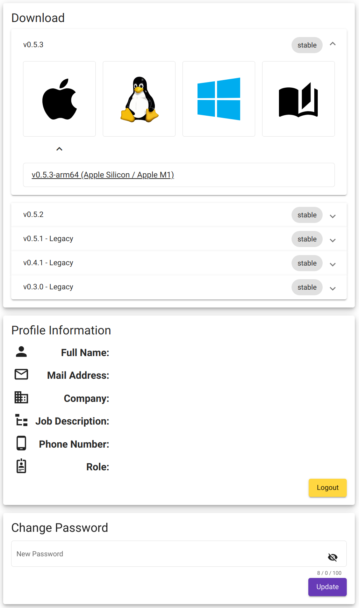

.. _website:

CODASystemOptimiser.com
=======================

The System Optimiser Website is used to download the latest version of the System Optimiser launcher, as well as managing your account.

Choose between MacOS, Windows and Linux versions of the launcher or additional documentation, and then follow the :ref:`installation instructions<installSO>`.

The login details for CODASystemOptimiser.com are used when logging into the :ref:`Data Version Manager<dvm>`.