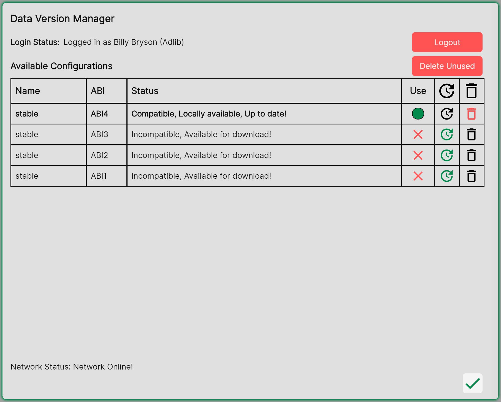

.. _DVM:

Data Version Manager
=======================
 
The Data Version Manager keeps System Optimiser up-to-date, and is used to download the :ref:`latest list of included speakers<listofspeakers>`.

Upon launching System Optimiser for the first time, you will be prompted to log in. Please use your :ref:`CODASystemOptimiser.com<website>` login details here.

Logging in is only required to download new data. You do not need an internet connection to run System Optimiser once installed.

**Downloading Datasets**

    

Datasets contain the under-the-hood information which System Optimiser uses to deliver accurate simulation and :ref:`mapping<SPLRendering>`.

Once logged in, available datasets will be listed in a table. The latest one will be at the top, and can be downloaded by clicking the download button:

Click the green 'use' button to select the dataset for use once downloaded, and then click the green :ref:`'tick'<input>` to close the Data Version Manager and start using System Optimiser.