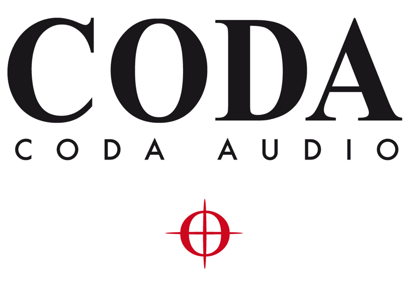

.. CODA System Optimiser documentation master file, created by
   sphinx-quickstart on Thu Jun 17 14:05:43 2021.
   You can adapt this file completely to your liking, but it should at least
   contain the root `toctree` directive.

.. CODA AUDIO

LINUS Control v2.3 documentation.
=================================

Table of Contents
=================

.. toctree::
   :maxdepth: 6

  operation_manual
   
Indices and tables
==================

* :ref:`genindex`
* :ref:`modindex`
* :ref:`search`

