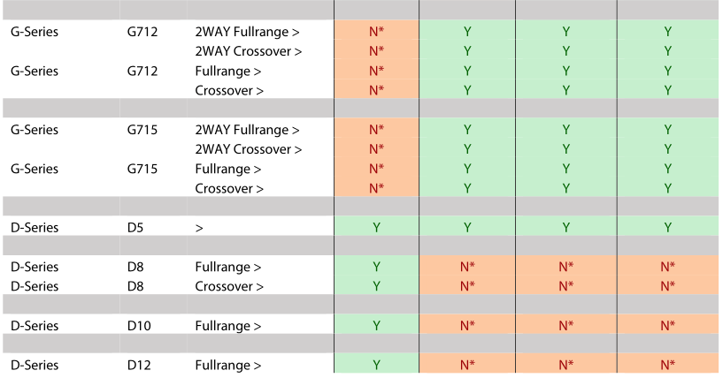
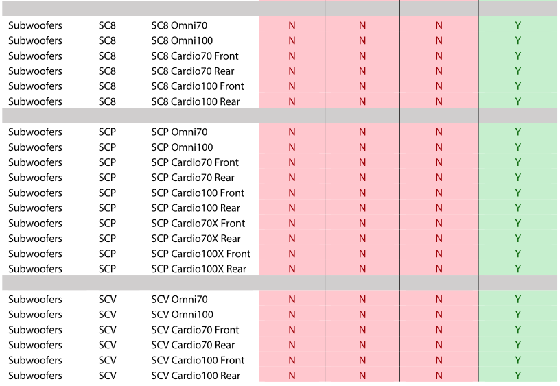

Loudspeaker File List
=====================

1. Loudspeaker file permissibility
----------------------------------

Not all loudspeakers are permitted on all amplifiers. A couple of factors dictate this; some loudspeakers require sensor control, which is not fitted to LINUS5-C, LINUS10-C and LINUS12C. Some loudspeakers require more power than certain amplifiers can provide. The table below details which loudspeakers are permissible on the various amplifier types. New additions bundled in this version are highlighted in purple.

.. raw:: html
    :file: speaker_file_permissibility.html

2. Loudspeaker file defaults
-----------------------------

Amplifiers contain a finite amount of storage locations. The list below details which loudspeaker files are permanently accessible from the Front Panel of the various amplifiers. Certain loudspeakers have been selectively omitted from the Front Panel recall, for reasons of storage space.

Files marked with an asterisk can however be loaded into the amplifier however,simply by choosing the preset within LINUS Control. To save them permanently to the amplifier, create a snapshot that includes the file & it will then be accessible from the Front Panel.

.. image:: assets/images/loudspeakerfiles/2/filedefault7.png
    :align: center

|

