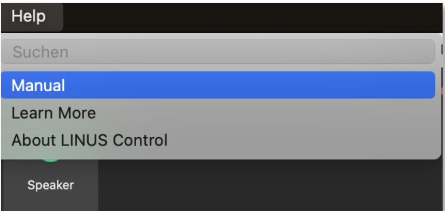
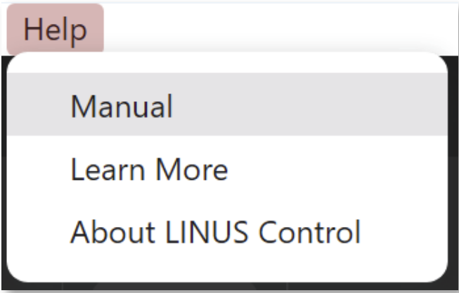

New Features
================

1. Release Notes
-----------------
    
1.1. New Speaker
+++++++++++++++++

The Speaker Library has been expanded with new Speaker Files:

**CiRAY**
    Array 60°, Array 90°, Array 120°, Array 60° >>, Array 90° >>, Array 120° >>

**HOPS12 Crossover**
    Crossover 90° x 60°, Crossover 60° x 40°, Crossover 90° x 60° >, Crossover 60° x 40° >,Crossover 90° x 60° >>, Crossover 60° x 40° >>

**SPACE Modules**
    M1
        LEFT/CENTER/RIGHT, LEFT/CENTER/RIGHT HIGH

    M2
        LEFT/CENTER/RIGHT, LEFT/CENTER/RIGHT HIGH

    M4
        CENTER, LEFT/RIGHT 

**SCX**
    - SCX Omni70
    - SCX Omni100

1.2. Speaker update
++++++++++++++++++++

N-RAY, G18 and PW418 Speaker with improved limiter operation.

1.3. Documentation
++++++++++++++++++++

Complete documentation is now implemented within LINUS Control application.
Accessible via Mac OS: Help > Manual

|

Windows:  Help > Manual

|

