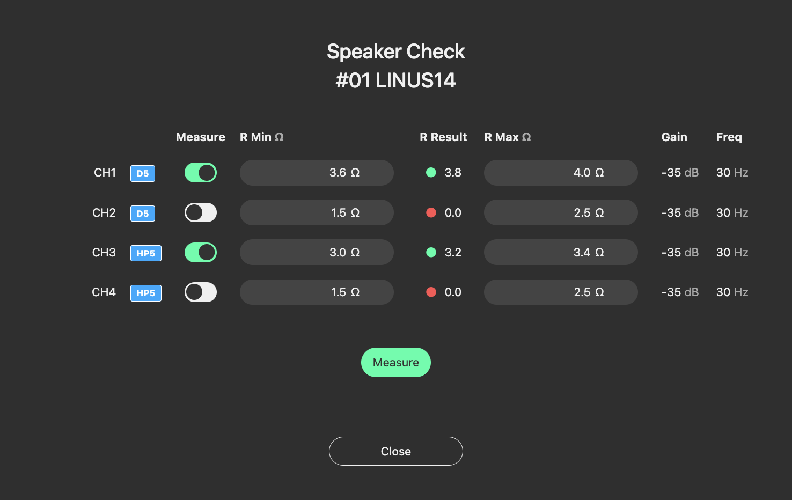

New Features
================

1. Release Notes
-----------------
    
1.1.  Speaker Check Application
++++++++++++++++++++++++++++++++

Speaker Check is now available for LINUS14 and LINUS12C amplifiers. This application verifies whether a loudspeaker line is connected or not connected.

|

1.2. Firmware Update 
++++++++++++++++++++

.. warning::
    Due to essential component updates on the LINUS14 / LINUS14D and LINUS12C amplifiers, no backwards compatibility for firmware versions older than V x.69 is possible.
    Affected amplifiers starting with this serial number:

    LINUS14/D:  19030863

    LINUS12C: 21090214

Please refer to the document “LINUS Control v2.3 Known Issues” for further information.

The new firmware version includes minor bug fixes and performance updates.

+-----------------------+-------------------+
| Product               | Firmware Version  |
+=======================+===================+
| LINUS CON             | V1.70             |
+-----------------------+-------------------+
| LINUS 14 / LINUS14-D  | V3.70             |
+-----------------------+-------------------+
| LINUS10               | V2.70             |
+-----------------------+-------------------+
| LINUS12C              | V3.70             |
+-----------------------+-------------------+
| LINUS10-C             | V5.70             |
+-----------------------+-------------------+
| LINUS5-C              | V5.70             |
+-----------------------+-------------------+

1.3. Speaker update  
+++++++++++++++++++

SC2-F and D5 Speakers have improved limiter operation.