Operation Manual
================

1. General
----------
Monitor and control the CODA LINUS amplification more simply than ever before. LINUS Control software provides a reliable application for the control and monitoring of the platform. It is optimised for both Mac OS and Windows, allowing you to control the app using whatever is convenient, on both tablet and native interfaces.  

Enjoy offline remote control of LINUS amplifiers using third party devices, perfect for installation. The Device Firmware, Loudspeaker Files, Control Logic and a third Party UDP Control protocol that will allow for offline remote control of LINUS amplifiers. Features such as snapshots and autosaving make your life simpler and will aid your audio setup when touring and planning shows.

1.1. Network
++++++++++++

Your devices can be controlled by a MacOS or Windows PC using the LINUS Control application. LINUS Amplifiers communicate using TCP & UDP on an Ethernet Network. Control data, Firmware and Loudspeaker Files all travel on this network, keeping control and communication simple even for huge networks. It is currently possible to control up to 250 LINUS devices on one physical Network. 

The amplifiers can exist on any subnet; however the last octet of the devices IP Address serves as an ID number for the amplifier in the application. Each LINUS Device needs a unique last octet, which is shown as the ID number in top-right of its Front Panel LCD. With duplicate IP addresses on the Network, performance of the whole network will be hampered and correct operation cannot be guaranteed. If multiple duplicate IP’s have recently existed on a network but have since been corrected (as with most IP based systems) it may be necessary to reboot the network switching and routing hardware, or wait for the switching fabric to update its internal MAC Address -> IP Table.

Whilst the individual devices are fitted with 100Mb/s interfaces, larger networks will benefit greatly from Gigabit networking infrastructure, especially the interface of the LINUS Control computer. The network should be built with CAT5e U/FTP Cable with a maximum length of 100m.  For lengths over 100m, ensure that you use Network Switches with Fibre links.

.. note::
    The length limit of 100m is normally only achievable with new, undamaged cable. The maximum achievable length of an Ethernet link may be significantly reduced below 100m if the cable is damaged / crushed / kinked / poor quality.

For optimum performance, ensure all LINUS IDs are unique on the network prior to connecting network infrastructure.  A star network topology should be used where practical. It is however generally possible to link (daisy-chain) up to six devices on a node. Further daisy-chaining may be possible, but should be tested to ensure reliable communication for the specific deployment. The Dante ports on the LINUS14D should (in most cases) be connected to a ‘distributed star’ topology network. Careful attention should be paid to ensure the minimum number of ‘switch hops’ between the transmitter & receivers, or the latency setting will need to be increased appropriately to guarantee network stability. 

.. code-block::

    Network protocol
    Protocol types: TCP, UDP
    Ports: 3000, 3001, 3011, 800, 8001
    Multicast address: Broadcast 255.255.255.255
    QoS Requirement: No
    Bandwidth: Ca. 16kb per device 
    DANTE: Channel and sample rate depending, please refer to Audinate's specification

1.2. Amplifier ID Numbers & IP Schema
++++++++++++++++++++++++++++++++++++++

Amplifiers have an addressable ID number in the top-right of the Front Panel LCD Display. 

This number can only be adjusted when LINUS Control is offline, or the amplifier is disconnected from the network. Typically, the Amplifiers are confined to the 192.168.1.X/24 subnet, however it is possible for the amplifiers to exist in any IP range and subnet.  

There is a limitation of 250 amplifiers on a network to be controlled with LINUS Control, and the amplifiers are individually identified within LINUS Control by the last octet of their IP.  This means that it would be completely acceptable to have an IP / Subnet setting on the control computer of **192.168.10.250/16 (255.255.0.0)** with two amplifiers at **192.168.10.1** and **192.168.181.13**, but it would not be possible for there to be two amplifiers at **192.168.14.140** and **192.168.29.140**, as their last octets (140) clash.

The ID Number in the top right of the LCD on the front panel of the amplifier or controllers always repeats the last octet of the IP address. 

.. note::
    Changing the IP address from the front panel will **always** change the amplifier back to the default 192.168.1.X range, where X is the ID number chosen from the front panel. To retain the custom IP Range, you must change the IP address of the amplifier either through LINUS Control, or using the 3rd Party Control protocol.

For example, an amplifier with ID Number #42 would have IP Address 192.168.1.42. 

.. note::
    Purely as a suggestion, for operation in the standard subnet, we would recommend setting the LINUS Control computer to: 192.168.1.251/16 (255.255.0.0). IP address 192.168.10.10 is reserved for the Firmware update channel, please avoid this IP on control surface and LINUS units.

1.3. Upgrading Firmware
+++++++++++++++++++++++++

LINUS Control contains internal logic to update the amplifiers firmware and loudspeaker library safely to the correct firmware. Please see the accompanying document “LINUS Update Procedure” to find the correct procedure for upgrading and downgrading Firmware.

.. note::
    Failure to upgrade the firmware as described within the accompanying document “LINUS Update Procedure” will result in amplifiers not being reachable by LINUS Control. In this case, they will need to be placed within Hardware Update mode, and the process restarted as prescribed in the document.

1.4. Multiple Clients
++++++++++++++++++++++

It is possible to run an instance of Google’s Chrome Browser on another computer, tablet or iPad for instance, and this can then control the LINUS Control backend server. 

(It is not possible to run multiple instances of LINUS Control on one host, or on the same control subnet.)

In order to use Chrome to control the backend server, follow these steps:

* Enable “Remote Access” within the LINUS Control settings page: 

.. Remote Access
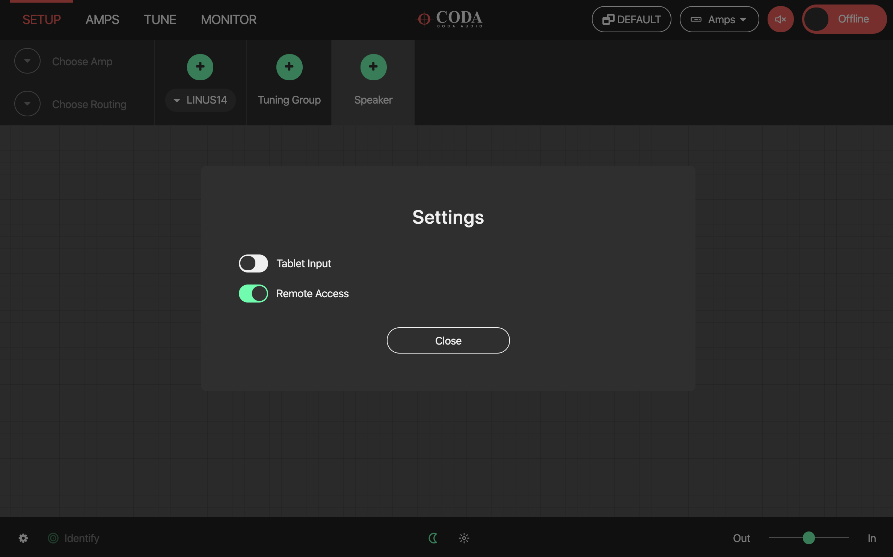

* Install / Run Google Chrome on the secondary device.
* Navigate in the web browser to the IP address of the LINUS Control host machine, followed by a colon (:), then 8111  (this is the control port).
* You will then be presented with a native LINUS Control interface.
* This will mitigate the need for use of VNC clients.

.. VNC client
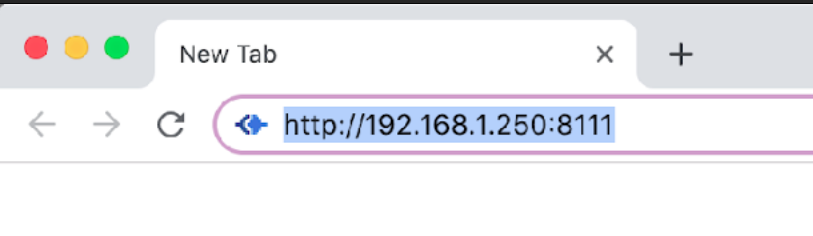

* In this example, 192.168.1.250 would be the IP address of the host machine.

2. LINUS Control Application
----------------------------

The LINUS Control application is simple to use, with an intuitive set of toolbars and visual tools to control your amplifiers. 

It is divided into three key areas; the top toolbar, the workspace and the bottom toolbar.  The top toolbar and bottom toolbar are the same through all the screens, and the workspace changes depending on which mode LINUS Control is operating in.

2.1. Top Toolbar
++++++++++++++++
The top toolbar contains the top-level operating modes of LINUS Control, a dropdown list for choosing the amplifier detail views, it also has a master mute button, the Fallback Recovery button and the control for taking LINUS Control Online or Offline.

.. Top Tool Bar

|    

2.2. Top Toolbar Modes
+++++++++++++++++++++++
The active mode is highlighted in RED. Keyboard shortcuts are mapped as below:

..  Top Toolbar Modes
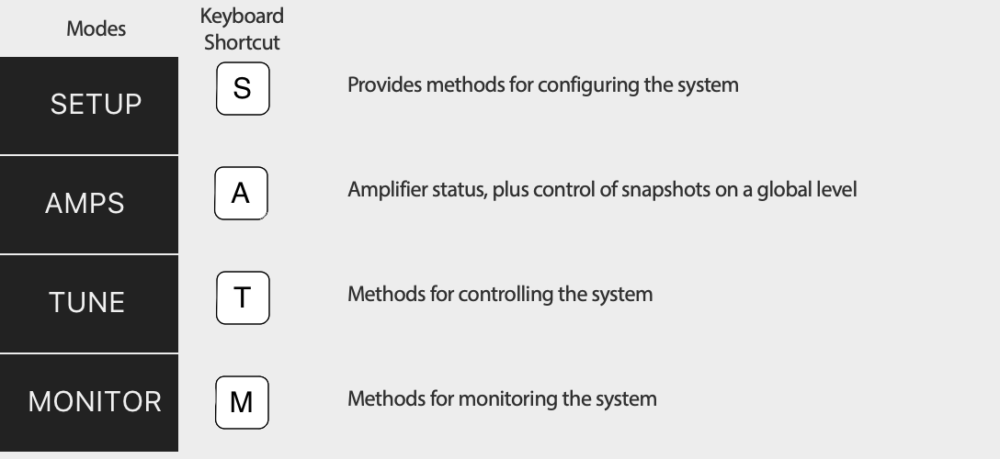

|

2.3. Top Toolbar Fallback Controls - Recover Digital
++++++++++++++++++++++++++++++++++++++++++++++++++++

This button is visible if one or more amplifiers in the workspace are running on their backup signal.  This would happen under one of the following circumstances:

* Their digital signal has been lost, or,
* The amplifiers were “forced” to fallback, either through front panel button presses, the 3rd Party Control protocol, or from the Q-SYS Plugin.

In either of these circumstances, the ‘Recover Digital’ button will be shown.  Pressing the button will command all connected amplifiers in the workspace to return to their primary digital signal.  If all amplifiers in the workspace successfully return to their primary digital signal, this button will then be hidden.

2.4.  Top Toolbar - Dropdown Detail View
+++++++++++++++++++++++++++++++++++++++++
The menu provides functionality for switching through the different view states of the Amplifier Icons. Its entities are also mapped to keyboard shortcuts [numbers ‘1’ through ‘8’].

..  Top Toolbar
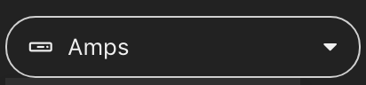

|

..  Dropdown Detail View
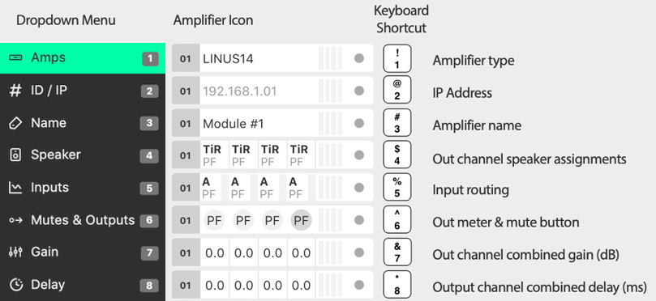

|    

2.4.1. Amplifier Type 
*********************

To provide a simple overview, the type of amplifier is displayed in the amplifier icons. 

This has implications for the creation of the show file. The key differences crucial for preset compatibility are detailed in the table below:

.. list-table::
   :widths: 25 25 25 15
   :header-rows: 1
   :align: center

   * - Amplifier Type
     - Sensor
     - Dante
     - LiNET Channels

   * - LINUS14
     - YES
     - Optional
     - 8
    
   * - LINUS10
     - YES
     - NO
     - 8

   * - LINUS10-C
     - NO
     - NO
     - 4

   * - LINUS12C
     - NO
     - Optional
     - 8

   * - LINUS5-C
     - NO
     - NO
     - 4

   * - LINUS CON
     - ALLOWED
     - NO
     - 8

Please see the accompanying document “LINUS Control Loudspeaker File List” to determine loudspeaker compatibility.

2.4.2. ID / IP 
***************
The ID number of the amplifier is displayed (as with all other detail views) in the left side of the icon. The IP Address for this amplifier is shown in the central area of the icon.

2.4.3. Amplifier Name
*********************
This is a ‘nickname’ that can be given to each amplifier in the workspace and keep things more organised. It is a standalone entry that is for your reference. Click the name and enter text to edit the name.

2.4.4. Speaker
**************
This view shows which loudspeakers are assigned to each channel. The top line displays a short name of the type of loudspeaker & the bottom line shows the type of the output channel.

..  Speaker
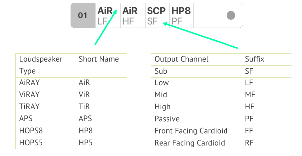

|

2.4.5. Inputs
**************

The channel input sources are shown on a per-channel basis. The Input Level meters are drawn on a per channel basis.

Prefixes:
    • A / B / C / D 				= Analog Inputs
    • 1 / 2 / 3 / 4 .. 8 			= LiNET Inputs
    • D1 / D2 / D3 / D4 			= Dante Inputs
Suffixes:
    • -- 	(negative sign)		= Polarity Inverted
    • !	(exclamation mark)		= Mixture of Inputs, or no input
   
The meters show the input signal level on a per-channel basis for the input assigned to that channel. 

• Input meters start at -60dBFS.
• When the peak level exceeds -10dBFS, the meter will turn yellow. 
• When the peak level exceeds -3dBFS, the meter will turn red.

2.4.6. Mutes & Outputs
**********************

For each channel, there is a combined mute button and output level indicator. If the mute is active on the channel, the indicator turns solid red. If the mute is inactive, the background of the channel is light grey.

..  Mutes & Outputs
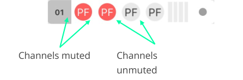

|

When the channel mutes are off, output meters are displayed in green behind the suffix. 

The output meters are calibrated in dB relative to the loudspeaker’s full RMS output potential on a per-channel basis.

    • Output meters start at -45dB (rel)
    • Output meters are full-scale at 0dB (rel)

|

To the right of each amplifier icon, a gain reduction meter is drawn. This shows gain reduction on a per-channel basis.

    • Gain Reduction meters start when there is -1dB of Gain reduction
    • Gain Reduction meters are full-scale at -6dB GR
    • Gain Reduction meters are red when there is -6dB GR or more

|

2.4.7. Gain 
***********
For each channel, the combined sum of all the group gains is displayed.

2.4.8. Delay 
************
For each channel, the combined sum of all the group delays is displayed.

|

2.5.  Top Toolbar - Master Mute
+++++++++++++++++++++++++++++++
A simple way for you to mute or unmute all connected & online amplifiers on the network. 
Red is muted, white is unmuted.

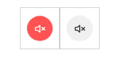

|

2.6.  Top Toolbar - Online / Offline
++++++++++++++++++++++++++++++++++++
This button toggles the software Online & Offline. 

|

2.7.   Top Toolbar – View
++++++++++++++++++++++++++

This button |default|  toggles View presets. Custom View presets can be created, these store selected elements and their position in the space (Amplifiers and Groups).

|

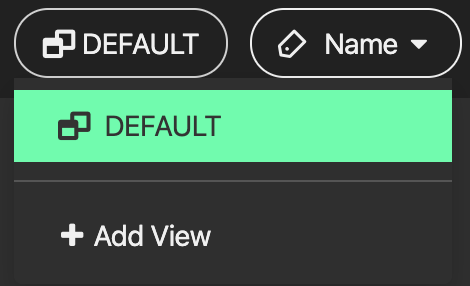

|

• Example 1: 

Group is unselected and Amplifier icons are displaced:

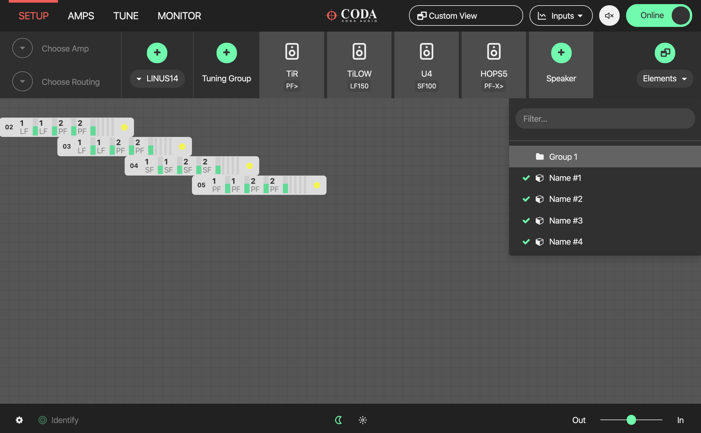

|

• Example 2: 

All elements selected and shown in the space, Amplifier and Group icons displaced:

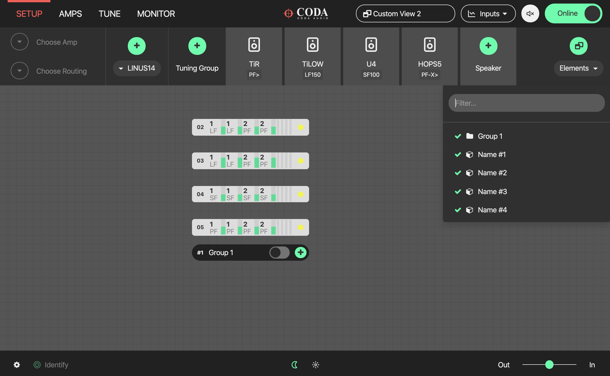

|

• Elements represent names of Amplifiers and Groups

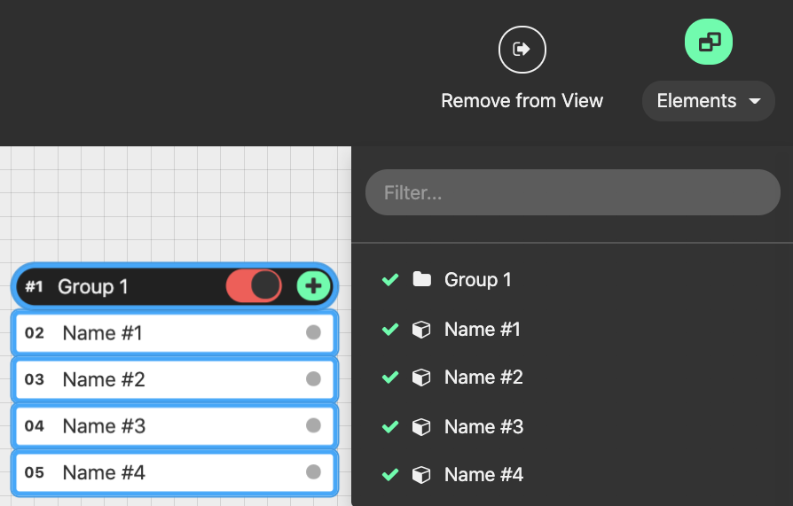

|

• Elements can be removed individually from the view. Simply select the element in the setup space and press this button:

|

• Custom View can be reset by pressing Default (Views are stored in the Linus Control file)

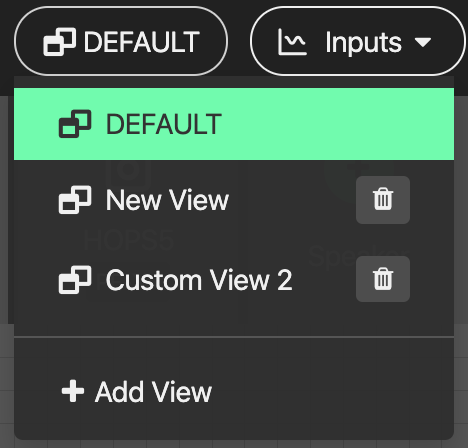

|

