Operation Manual
================

1. General
----------
Monitor and control the CODA LINUS amplification more simply than ever before. LINUS Control software provides a reliable application for the control and monitoring of the platform. It is optimised for both Mac OS and Windows, allowing you to control the app using whatever is convenient, on both tablet and native interfaces.  

Enjoy offline remote control of LINUS amplifiers using third party devices, perfect for installation. The Device Firmware, Loudspeaker Files, Control Logic and a third Party UDP Control protocol that will allow for offline remote control of LINUS amplifiers. Features such as snapshots and autosaving make your life simpler and will aid your audio setup when touring and planning shows.

1.1. Network
++++++++++++

Your devices can be controlled by a MacOS or Windows PC using the LINUS Control application. LINUS Amplifiers communicate using TCP & UDP on an Ethernet Network. Control data, Firmware and Loudspeaker Files all travel on this network, keeping control and communication simple even for huge networks. It is currently possible to control up to 250 LINUS devices on one physical Network. 

The amplifiers can exist on any subnet; however the last octet of the devices IP Address serves as an ID number for the amplifier in the application. Each LINUS Device needs a unique last octet, which is shown as the ID number in top-right of its Front Panel LCD. With duplicate IP addresses on the Network, performance of the whole network will be hampered and correct operation cannot be guaranteed. If multiple duplicate IP’s have recently existed on a network but have since been corrected (as with most IP based systems) it may be necessary to reboot the network switching and routing hardware, or wait for the switching fabric to update its internal MAC Address -> IP Table.

Whilst the individual devices are fitted with 100Mb/s interfaces, larger networks will benefit greatly from Gigabit networking infrastructure, especially the interface of the LINUS Control computer. The network should be built with CAT5e U/FTP Cable with a maximum length of 100m.  For lengths over 100m, ensure that you use Network Switches with Fibre links.

.. note::
    The length limit of 100m is normally only achievable with new, undamaged cable. The maximum achievable length of an Ethernet link may be significantly reduced below 100m if the cable is damaged / crushed / kinked / poor quality.

For optimum performance, ensure all LINUS IDs are unique on the network prior to connecting network infrastructure.  A star network topology should be used where practical. It is however generally possible to link (daisy-chain) up to six devices on a node. Further daisy-chaining may be possible, but should be tested to ensure reliable communication for the specific deployment. The Dante ports on the LINUS14D should (in most cases) be connected to a ‘distributed star’ topology network. Careful attention should be paid to ensure the minimum number of ‘switch hops’ between the transmitter & receivers, or the latency setting will need to be increased appropriately to guarantee network stability. 

.. code-block::

    Network protocol
    Protocol types: TCP, UDP
    Ports: 3000, 3001, 3011, 800, 8001
    Multicast address: Broadcast 255.255.255.255
    QoS Requirement: No
    Bandwidth: Ca. 16kb per device 
    DANTE: Channel and sample rate depending, please refer to Audinate's specification

1.2. Amplifier ID Numbers & IP Schema
++++++++++++++++++++++++++++++++++++++

Amplifiers have an addressable ID number in the top-right of the Front Panel LCD Display. 

This number can only be adjusted when LINUS Control is offline, or the amplifier is disconnected from the network. Typically, the Amplifiers are confined to the 192.168.1.X/24 subnet, however it is possible for the amplifiers to exist in any IP range and subnet.  

There is a limitation of 250 amplifiers on a network to be controlled with LINUS Control, and the amplifiers are individually identified within LINUS Control by the last octet of their IP.  This means that it would be completely acceptable to have an IP / Subnet setting on the control computer of **192.168.10.250/16 (255.255.0.0)** with two amplifiers at **192.168.10.1** and **192.168.181.13**, but it would not be possible for there to be two amplifiers at **192.168.14.140** and **192.168.29.140**, as their last octets (140) clash.

The ID Number in the top right of the LCD on the front panel of the amplifier or controllers always repeats the last octet of the IP address. 

.. note::
    Changing the IP address from the front panel will **always** change the amplifier back to the default 192.168.1.X range, where X is the ID number chosen from the front panel. To retain the custom IP Range, you must change the IP address of the amplifier either through LINUS Control, or using the 3rd Party Control protocol.

For example, an amplifier with ID Number #42 would have IP Address 192.168.1.42. 

.. note::
    Purely as a suggestion, for operation in the standard subnet, we would recommend setting the LINUS Control computer to: 192.168.1.251/16 (255.255.0.0). IP address 192.168.10.10 is reserved for the Firmware update channel, please avoid this IP on control surface and LINUS units.

1.3. Upgrading Firmware
+++++++++++++++++++++++++

LINUS Control contains internal logic to update the amplifiers firmware and loudspeaker library safely to the correct firmware. Please see the accompanying document “LINUS Update Procedure” to find the correct procedure for upgrading and downgrading Firmware.

.. note::
    Failure to upgrade the firmware as described within the accompanying document “LINUS Update Procedure” will result in amplifiers not being reachable by LINUS Control. In this case, they will need to be placed within Hardware Update mode, and the process restarted as prescribed in the document.

1.4. Multiple Clients
++++++++++++++++++++++

It is possible to run an instance of Google’s Chrome Browser on another computer, tablet or iPad for instance, and this can then control the LINUS Control backend server. 

(It is not possible to run multiple instances of LINUS Control on one host, or on the same control subnet.)

In order to use Chrome to control the backend server, follow these steps:

* Enable “Remote Access” within the LINUS Control settings page: 

.. Remote Access
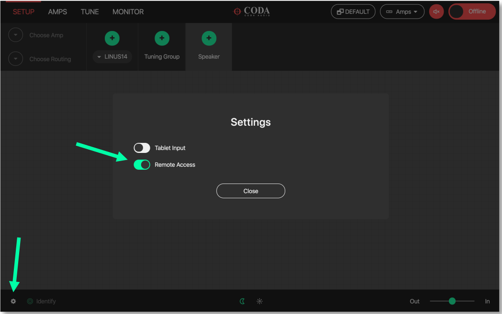

* Install / Run Google Chrome on the secondary device.
* Navigate in the web browser to the IP address of the LINUS Control host machine, followed by a colon (:), then 8111  (this is the control port).
* You will then be presented with a native LINUS Control interface.
* This will mitigate the need for use of VNC clients.

.. VNC client
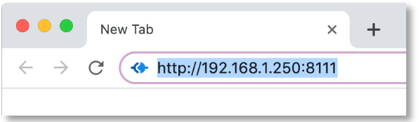

* In this example, 192.168.1.250 would be the IP address of the host machine.

2. LINUS Control Application
----------------------------

The LINUS Control application is simple to use, with an intuitive set of toolbars and visual tools to control your amplifiers. 

It is divided into three key areas; the top toolbar, the workspace and the bottom toolbar.  The top toolbar and bottom toolbar are the same through all the screens, and the workspace changes depending on which mode LINUS Control is operating in.

2.1. Top Toolbar
++++++++++++++++
The top toolbar contains the top-level operating modes of LINUS Control, a dropdown list for choosing the amplifier detail views, it also has a master mute button, the Fallback Recovery button and the control for taking LINUS Control Online or Offline.

.. Top Tool Bar

|    

2.2. Top Toolbar Modes
+++++++++++++++++++++++
The active mode is highlighted in RED. Keyboard shortcuts are mapped as below:

..  Top Toolbar Modes
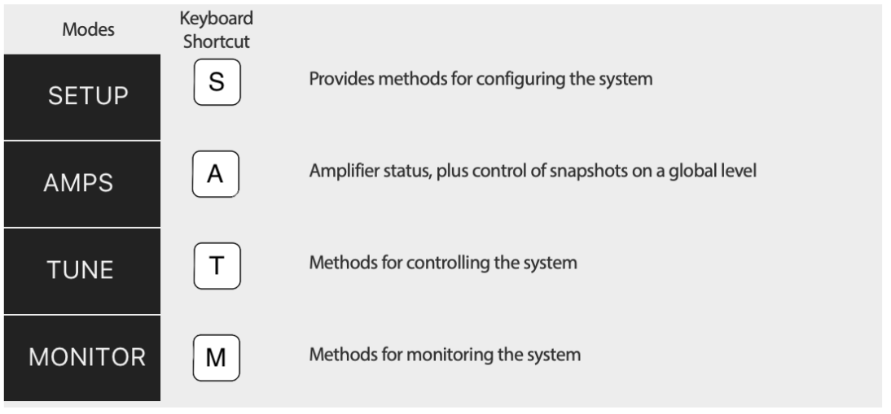

|

2.3. Top Toolbar Fallback Controls - Recover Digital
++++++++++++++++++++++++++++++++++++++++++++++++++++

This button is visible if one or more amplifiers in the workspace are running on their backup signal.  This would happen under one of the following circumstances:

* Their digital signal has been lost, or,
* The amplifiers were “forced” to fallback, either through front panel button presses, the 3rd Party Control protocol, or from the Q-SYS Plugin.

In either of these circumstances, the ‘Recover Digital’ button will be shown.  Pressing the button will command all connected amplifiers in the workspace to return to their primary digital signal.  If all amplifiers in the workspace successfully return to their primary digital signal, this button will then be hidden.

2.4.  Top Toolbar - Dropdown Detail View
+++++++++++++++++++++++++++++++++++++++++
The menu provides functionality for switching through the different view states of the Amplifier Icons. Its entities are also mapped to keyboard shortcuts [numbers ‘1’ through ‘8’].

..  Top Toolbar
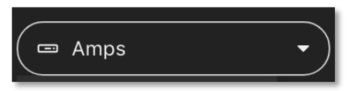

|

..  Dropdown Detail View
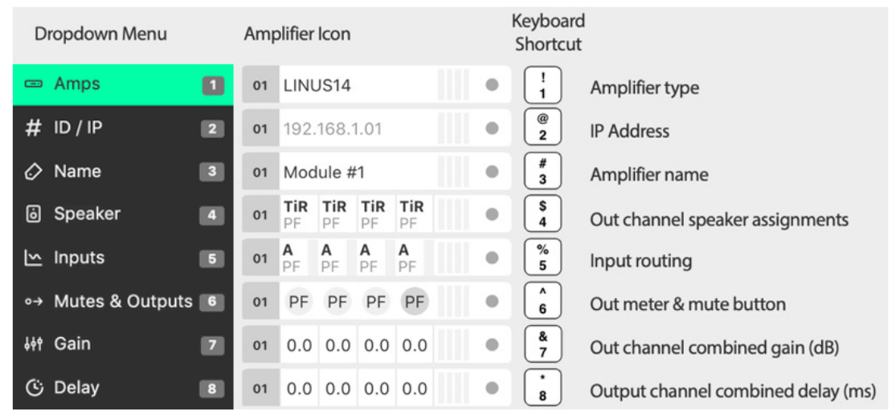

|    

2.4.1. Amplifier Type 
*********************

To provide a simple overview, the type of amplifier is displayed in the amplifier icons. 

This has implications for the creation of the show file. The key differences crucial for preset compatibility are detailed in the table below:

.. list-table::
   :widths: 25 25 25 15
   :header-rows: 1
   :align: center

   * - Amplifier Type
     - Sensor
     - Dante
     - LiNET Channels

   * - LINUS14
     - YES
     - Optional
     - 8
    
   * - LINUS10
     - YES
     - NO
     - 8

   * - LINUS10-C
     - NO
     - NO
     - 4

   * - LINUS12C
     - NO
     - Optional
     - 8

   * - LINUS5-C
     - NO
     - NO
     - 4

   * - LINUS CON
     - ALLOWED
     - NO
     - 8

Please see the accompanying document “LINUS Control Loudspeaker File List” to determine loudspeaker compatibility.

2.4.2. ID / IP 
***************
The ID number of the amplifier is displayed (as with all other detail views) in the left side of the icon. The IP Address for this amplifier is shown in the central area of the icon.

2.4.3. Amplifier Name
*********************
This is a ‘nickname’ that can be given to each amplifier in the workspace and keep things more organised. It is a standalone entry that is for your reference. Click the name and enter text to edit the name.

2.4.4. Speaker
**************
This view shows which loudspeakers are assigned to each channel. The top line displays a short name of the type of loudspeaker & the bottom line shows the type of the output channel.

..  Speaker

|

2.4.5. Inputs
**************

The channel input sources are shown on a per-channel basis. The Input Level meters are drawn on a per channel basis.

Prefixes:
    • A / B / C / D 				= Analog Inputs
    • 1 / 2 / 3 / 4 .. 8 			= LiNET Inputs
    • D1 / D2 / D3 / D4 			= Dante Inputs
Suffixes:
    • -- 	(negative sign)		= Polarity Inverted
    • !	(exclamation mark)		= Mixture of Inputs, or no input
   
The meters show the input signal level on a per-channel basis for the input assigned to that channel. 

• Input meters start at -60dBFS.
• When the peak level exceeds -10dBFS, the meter will turn yellow. 
• When the peak level exceeds -3dBFS, the meter will turn red.

2.4.6. Mutes & Outputs
**********************

For each channel, there is a combined mute button and output level indicator. If the mute is active on the channel, the indicator turns solid red. If the mute is inactive, the background of the channel is light grey.

..  Mutes & Outputs

|

When the channel mutes are off, output meters are displayed in green behind the suffix. 

The output meters are calibrated in dB relative to the loudspeaker’s full RMS output potential on a per-channel basis.

    • Output meters start at -45dB (rel)
    • Output meters are full-scale at 0dB (rel)

|

To the right of each amplifier icon, a gain reduction meter is drawn. This shows gain reduction on a per-channel basis.

    • Gain Reduction meters start when there is -1dB of Gain reduction
    • Gain Reduction meters are full-scale at -6dB GR
    • Gain Reduction meters are red when there is -6dB GR or more

|

2.4.7. Gain 
***********
For each channel, the combined sum of all the group gains is displayed.

2.4.8. Delay 
************
For each channel, the combined sum of all the group delays is displayed.

.. image:: assets/images/operation_manual/2/delay.png
    :align: center

|

2.5.  Top Toolbar - Master Mute
+++++++++++++++++++++++++++++++
A simple way for you to mute or unmute all connected & online amplifiers on the network. 
Red is muted, white is unmuted.

|

2.6.  Top Toolbar - Online / Offline
++++++++++++++++++++++++++++++++++++
This button toggles the software Online & Offline. 

|

2.7.   Top Toolbar – View
++++++++++++++++++++++++++

This button |default|  toggles View presets. Custom View presets can be created, these store selected elements and their position in the space (Amplifiers and Groups).

|

|

• Example 1: 

Group is unselected and Amplifier icons are displaced:

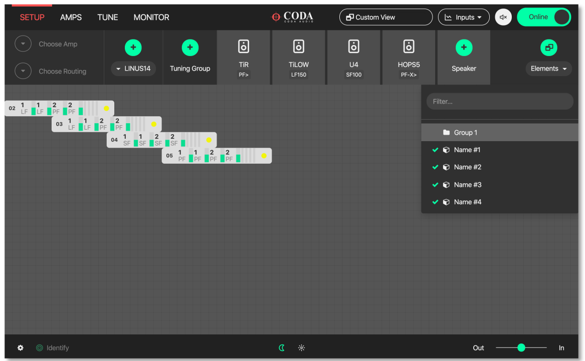

|

• Example 2: 

All elements selected and shown in the space, Amplifier and Group icons displaced:

|

• Elements represent names of Amplifiers and Groups

|

• Elements can be removed individually from the view. Simply select the element in the setup space and press this button:

.. image:: assets/images/operation_manual/2/removefromviews.png
    :align: center

|

• Custom View can be reset by pressing Default (Views are stored in the Linus Control file)

.. image:: assets/images/operation_manual/2/customviews.png
    :align: center

|

3. Bottom Toolbar
------------------

The Bottom Toolbar contains tools relevant to the LINUS Control window & the extra functionality of amplifier identification.  

|

3.1. Bottom Toolbar – Lock 
++++++++++++++++++++++++++

The Lock function protects you against mistakes that can potentially ruin your sound mid-show. The Padlock icon in the Bottom Toolbar is displayed when the operation mode is changed to “MONITOR” in the Top Toolbar. When pressed, it will turn red/orange and all interface controls will be locked to safeguard against inadvertent keyboard or mouse inputs during the show.

|

3.2. Bottom Toolbar – Identify 
++++++++++++++++++++++++++++++
Click ‘Identify‘ to flash the LED’s on the amplifiers that are selected on the workspace.

|

3.3. Bottom Toolbar - Night Mode/Day Mode
+++++++++++++++++++++++++++++++++++++++++
A view to suit you and stay easy on the eyes. The button in the centre of the Bottom Toolbar toggles the interface between night & day mode. 

|

3.4.  Bottom Toolbar – Zoom
++++++++++++++++++++++++++++

View the software just as easily on any screen resolution or size. The slider in the bottom right side of the Bottom Toolbar scales the workspace and its contents.  This allows for the optimum display size on different resolution screens from small systems to large ones.

3.5.  Bottom Toolbar – Settings
+++++++++++++++++++++++++++++++

Pressing the settings ‘cog’ or ‘gear’ icon will bring up the application settings page.

3.6. Bottom Toolbar – ‘Attention Getter’
++++++++++++++++++++++++++++++++++++++++

The background of the Bottom Toolbar is black by default.  In the event of an error, it will change its background colour accordingly.  This serves to quickly get the attention of the user in a subtle way.  Clicking the background of the Bottom Toolbar will navigate to the AMPS view, where the error status of the amplifier(s) can be seen.

In the case of an Error, the Bottom Toolbar background will change to a red colour to show that it needs your attention urgently.

|

4. Setup Mode
--------------

Design your workspace ideally for your specific audio needs. The setup page is the start point for the design of the workspace. From here, it is possible to add Amplifiers & Groups to the workspace, choose input routing, assign groups and arrange your system in a logical manner.

Key Concepts:

• Amplifiers are displayed with the following icon style:

|

• Tuning Groups are displayed with the following icon style:

|

• Loudspeakers are assigned to Amplifier Channels.
• Amplifier Channels are assigned to Tuning Groups.
• Tuning Group parameters are adjusted on the TUNE page.

4.1. Setup Mode - Top Toolbar
+++++++++++++++++++++++++++++

In Setup mode, an extra toolbar is visible underneath the Top Toolbar. More advanced, setup-specific controls are displayed here, which are not necessary in the Tune or Monitor modes.

|

4.2.  Setup Mode - Add Amplifier
++++++++++++++++++++++++++++++++

Pressing the plus icon (or pressing Cmd + F) will add a new amplifier of the selected type into the workspace. It will be given the next logical ID (next free ID number, numerically ascending).  The type of amplifier can be chosen by pressing the bottom half of the icon and choosing from the list.

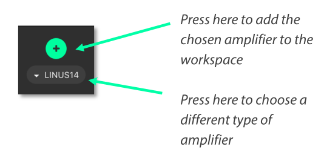

|

4.3.Setup Mode - Delete Amplifier / Group
+++++++++++++++++++++++++++++++++++++++++
Pressing the ‘X’ icon will remove all selected Amplifiers and Groups from the workspace.

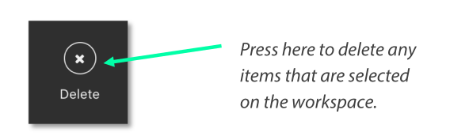

|

A confirmation dialog is presented to confirm this action:

|

4.4.  Setup Mode – Choose Loudspeakers
+++++++++++++++++++++++++++++++++++++++

When a new file is created and an Amplifier is added to the workspace, a loudspeaker file is added to the loudspeaker banner. Additional loudspeakers can be added to the banner by pressing the “+” button.  This loudspeaker file has two areas:

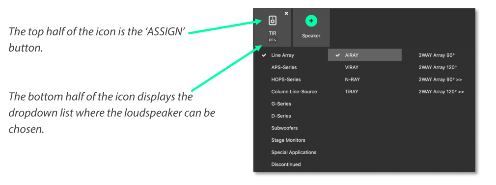

|

|

|

4.5.  Setup Mode – ‘Lasso Assign’ Loudspeakers to Channels
++++++++++++++++++++++++++++++++++++++++++++++++++++++++++

When the loudspeaker is in ‘Assign’ mode, it is possible to click and drag a bounding box to assign the channels quickly to multiple channels:

|

4.6. Setup Mode – Remove Loudspeakers from Loudspeakers Bar
+++++++++++++++++++++++++++++++++++++++++++++++++++++++++++

When a loudspeaker is not assigned to any amplifier in the workspace, a small cross is displayed in the upper right of the icon. Clicking this will remove it from the Loudspeakers bar:

|

4.7. Setup Mode – Add Tuning Group
++++++++++++++++++++++++++++++++++

Pressing this button (or pressing Cmd + G) will add a new Tuning Group to the workspace.

.. note::
    If the user clicks the Add Tuning Group button, then immediately starts typing the desired name of the group, before pressing ‘Enter’, the Tuning Group will assign this text as its name.

|

4.8. Setup Mode - Name Tuning Group
+++++++++++++++++++++++++++++++++++

Single clicking the group selects it. Double clicking the group enables the name to be changed.  Press enter on the keyboard to set the name.

|

4.9.   Setup Mode - Assign Loudspeakers to a Group
++++++++++++++++++++++++++++++++++++++++++++++++++

Clicking the green ‘Plus’ Arrow |plusicon| on the group places it into ‘Assign’ mode. 
The Group’s background colour will change to green to indicate this.

Click the desired Loudspeakers to assign them to the Group.
Click the |assignallbutton|  button to assign all the Loudspeakers / Amp Channels into the Group.

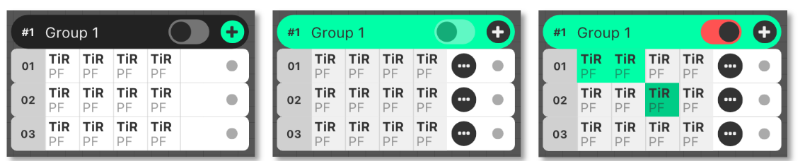

|

4.10. Setup Mode – Lasso Assign Loudspeakers to a Group
+++++++++++++++++++++++++++++++++++++++++++++++++++++++

When the group is in ‘Assign’ mode, it is easy to click and drag a blue bounding box to add loudspeakers into that group.  Pressing ‘Shift’ and clicking the bounding box will remove the chosen loudspeakers from that group (the bounding box will be red in this case):

|

4.11. Setup Mode – Group Assign Alternate Method
+++++++++++++++++++++++++++++++++++++++++++++++++

If Amplifiers are selected when you add a new group to the workspace, they will be added to the group automatically.

4.12. Setup Mode – Change Amplifier
+++++++++++++++++++++++++++++++++++

It is possible to change the type of Amplifier in the offline workspace. Select the Amplifiers in the workspace, either with the multiselect lasso or by clicking them individually, then click the “Choose Amp” dropdown in the toolbar.

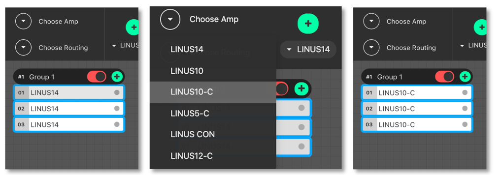

|

4.13.Setup Mode – Replace Amplifier ID
++++++++++++++++++++++++++++++++++++++

It is simple to change the ID of an amplifier in the workspace when Offline. In Setup mode, double click the ID number of the amplifier in the workspace.  The following dialog will be presented:

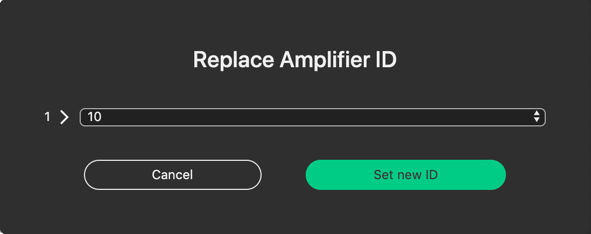

|

4.14. Setup Mode - Set Routing
++++++++++++++++++++++++++++++

It is also straightforward to adjust the input routing of one or more amplifiers at the same time. 

.. note::
     There are a couple of variables that affect the routing possibilities, namely, the Amplifier Type and Loudspeaker Choice. If more than one Amplifier is selected and this selection comprises different Loudspeaker types and/or Amplifier types, the lowest common denominator of routing possibilities will be presented in the Routing Window. For instance, if two LINUS14’s are selected, with AiRAY (a 2-WAY enclosure) selected on the first and SCP (a 1-WAY enclosure) on the second, the Routing Window would only allow for patching Channels 1+2 and Channels 3+4 as a 2-WAY pair, even for the Amplifier with the SCP assigned.

Select the Amplifier(s)

Click the “Choose Routing” button:

|

Choose “Analog” or “Digital”:

    • Input signals are shown in the vertical columns
    • Outputs are shown in the horizontal rows
    • Click the ‘Ticks’ to patch the Inputs to the Outputs
    • The Output Polarity buttons are the toggle switches to the right of the Outputs

|

.. note::
     The Dante patch is fixed one to one within the firmware. To adjust the routing within Dante, please use Audinate’s Dante Controller. 

All amplifiers, with the exception of LINUS10 and LINUS CON, when online, can be put in and out of ‘standby’ from the AMPS page within LINUS Control.

To recap, an amplifier is shown as on or in standby by displaying a grey colour to the left of the icon in the SETUP page:

|

Amplifiers set in standby wake up in the AMPS Section:

**On**

|

**Standby**

|

**Wake Up**

|

To place an amplifier in standby, or remove it from standby, using LINUS Control online, click the ”Power” button in the AMPS page. This will toggle the amp between on and standby. The front panel switch works in combination with LINUS Control in a “Latest takes precedence” manner, which means LINUS Control can override a front panel switch and “wake up” an amplifier that’s in standby with its front panel switch off.

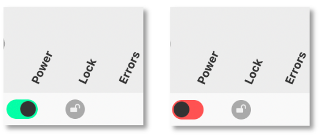

|

Waking up the amplifier can be done in the AMPS page or in the SETUP page, simply by clicking the grey square on the left.

.. image:: assets/images/operation_manual/4/amppoweroff.png
    :align: center

|

|

5. AMPS Page 
-------------

The AMPS Page gives a quick and efficient overview of the status of all connected amplifiers in the system. 
It also provides the interface for the Snapshot, State and IP functionality (these are explained below) .

5.1. AMPS Page - List of Amplifiers
+++++++++++++++++++++++++++++++++++

Arranged numerically by ID number, the Amplifier List is integral to the AMPS Page. 
On the left, after the ID Number you will see the Amplifier Type.
The Loudspeakers assigned to the channels are next represented by blue icons.
There is an Amplifier-specific ‘Store Snapshot’ button in each row.

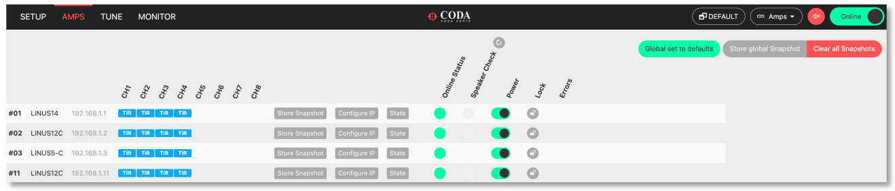

|

5.2. AMPS Mode - Online Status
+++++++++++++++++++++++++++++++

If the amplifier is online, a green indicator is shown here. 

|

5.3. Snapshots
+++++++++++++++

Snapshots are a convenient way of storing the absolute state of an amplifier at an exact point in time. Absolutely all parameters are stored, apart from the ID of the Amplifier and the contents of the other Snapshots. 

Snapshots can either be recalled from the Front Panel, or from the 3rd Party UDP Commands which are detailed in the accompanying document “LINUS Third Party Control”.

.. note::
    There is a fundamental difference in operation between the legacy application LINUS Live v1.X and LINUS Control v2.X in that there are no ‘Presets’ stored within the Amplifiers, only the 20x Snapshots and the ‘Live State’ of the Amplifier as commanded by LINUS Control.

.. note::
    Snapshots cannot be stored or overwritten from the Front Panel on LINUS5-C and LINUS10-C Amplifiers.  On LINUS14 / LINUS10, LINUS CON and LINUS12-C, Snapshot locations 1 through 10 inclusively have read-write access from the Front Panel. Snapshot locations 11 through 20 inclusively are read only from the Front Panel & can only be stored or overwritten from LINUS Control. 

Example Usage
Scenario A). (Semi)-Permanent Installation
The Sound Designer commissions the system and saves a LINUS Control Show File.  He or she also creates a couple of other deployments of the same system, when the ‘venue’ is utilised for different roles, again, creating show files for these.

I.E: 
    • There is a main system with delays, all perfectly time aligned and tuned to cover one big room and ensure a consistent sound.
and
    • It is also possible to compartmentalise the same large room into smaller rooms, whereby the delays are rotated around to act as the main system for the smaller ‘satellite’ rooms. 

In this instance, when s/he is happy with the tuning of the system for the larger room, s/he will press the “Store Global Snapshot” button on the top right of the AMPS Page. 

|

A window will then pop up, where you can choose the Snapshot Location, along with a suitable name for the Snapshot. This Snapshot Location is used together with the Snapshot Name to identify it to the user on the Front Panel. It is also used as a reference for recall using the 3rd Party UDP Control Protocol, which can be commanded from most network devices that can transmit custom UDP Messages, for example Crestron™ Remotes.

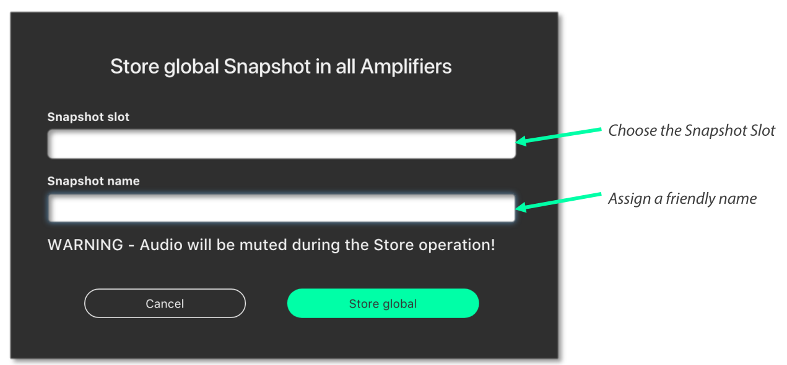

|

.. note::
     The software will show an error [mixed snapshots] in the ‘Snapshot slot’ list if snapshots with different names are stored in the same slot in multiple amplifiers.

|

.. note::
    As the popup states, when the Snapshots are stored, the audio will be muted temporarily as the memory is accessed. For this reason, it is vital not to store Snapshots during a show! 

When the Store operation is complete the following message will be displayed in the lower right-hand side of the LINUS Control Workspace:
    

|

If you then make alterations such as Tuning Parameters / Loudspeakers / Routing etc. in the LINUS Control show file, you can then store a new snapshot in a new location. This makes it quick and easy to recall settings from the front panel of different offline ‘States’ of the LINUS Control show.

Scenario B).  Rental Company
This feature helps to improve what rental companies can offer their customers. A hire company may wish to send out small systems with operators who do not wish to use the LINUS Control software and just want to recall the setup from the Front Panel.

Prior to dispatching the equipment, the hire company can configure the different smaller systems that are used and save these as Snapshots, so the end user only needs to choose a Snapshot and Recall it from the Front Panel.

Example – 2x HOPS8 on 2x G15 Subs.
Firstly, the Loudspeakers are assigned to the Amplifier:

|

The input routing is then assigned:

|

A Tuning Group is then assigned to the G15 Subs, in order to add the 2.2ms coplanar delay (this is easy to determine from the time alignment spreadsheet guide).

|

The Snapshot should now be stored on this amplifier, to enable offline recall from the Front Panel on site.  Group Parameters (Gain / Delay / EQ etc. can be adjusted from the Front Panel without use of a computer).

5.4. IP Address Range
+++++++++++++++++++++

The LINUS Amplifiers & LINUS Control can exist in any IP Range & Subnet, they are not required to be in the 192.168.1.X range. 

There is a limitation of 250 amplifiers on a network, for them to be controlled with LINUS Control, and the amplifiers are individually identified within LINUS Control by the last octet of their IP address. This means that it would be completely acceptable to have an IP / Subnet setting on the control computer of **192.168.10.250 / 255.255.0.0** with two amplifiers at **192.168.10.1** and **192.168.181.13**, but it would not be possible for there to be two amplifiers at **192.168.14.140** and **192.168.29.140**, as their last octets (.140) clash.

The ID number in the top right of the LCD on the front panel of the amplifier / controllers always show the last octet of the IP address. 

.. note::
    Changing the IP address from the front panel will always change the amplifier back to the default 192.168.1.X range, where X is the ID number chosen from the front panel. To retain the custom IP Range, you must change the IP Address of the amplifier either through LINUS Control, or with the 3rd party control protocol.

If you wish to change the amplifier to a custom range within LINUS Control, take a note of the current IP Address of the amplifier. Ensure that the subnet mask of the control computer will allow the LINUS Control application to talk to the amplifier; if this is set incorrectly, the amplifier may still be discovered by LINUS Control, however it will not be able to communicate. In this instance, you will see an error message in the discovery list as “not reachable”:

|

With the IP and Subnet of the control computer set correctly, the device will be reachable and can be added to the workspace:

|

When the amplifier is added to the workspace, click the relevant **Configure IP button**, on the AMPS page. This will launch a dialog, where the IP Address of the amplifier can be adjusted.

|

If the last octet of the new IP address is unchanged, the amplifier will show up on the workspace with the new IP. If not, it will show as offline on the workspace, and it will also show up as a newly discovered amplifier within the discovery list – it can then be replaced with the amplifier in the workspace using the standard method.

.. note::
    IP address 192.168.10.10 is reserved for the Firmware update channel, please avoid this IP on control surface and LINUS units.

State Manager, please refer to section 8.5.

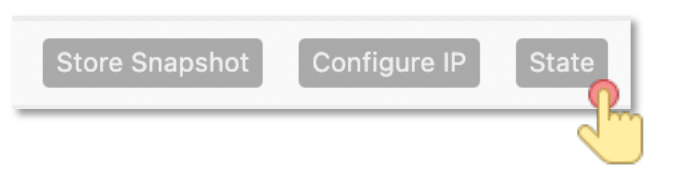

|

5.5.  Speaker Check
+++++++++++++++++++++

Speaker Check is a tool for checking loudspeaker connection lines and loudspeaker impedance when connected to LINUS14 and LINUS12C.

|

5.5.1.Start Speaker Check application  
**************************************

|

5.5.2. Speaker Check overview 
******************************

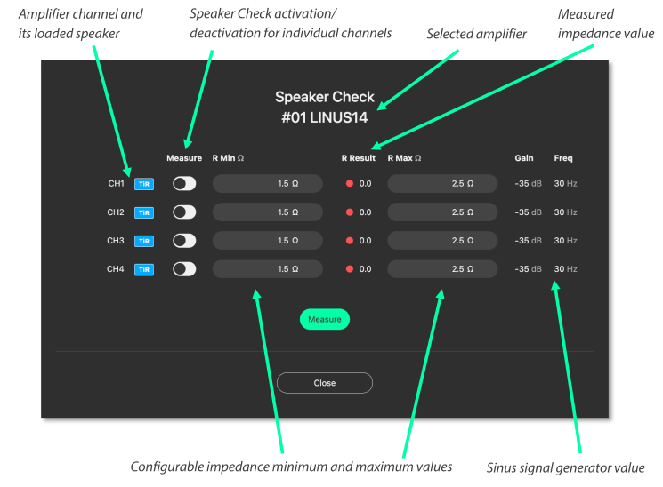

|

5.5.3. Speaker Check Setup  
******************************

    1. Define the speakers in the setup section first
    2. Select the amplifier on which you would like to run the Speaker Check application
    3. Select amplifier channels that should run the Speaker Check

*Example shows Speaker Check activated for CH1 (loaded speaker: D5) and CH3 (loaded speaker HOPS5)*

.. image:: assets/images/operation_manual/5/speakerchecksetup.png
    :align: center

|

4. Connect amplifier channels with the loudspeaker and press “Measure”.
At this point you may hear the sine wave generator running (at -35dB / 30Hz) at a low level.
The selected channels will be measured one by one, consecutively (measurement per channel takes roughly 3 seconds).

Example shows a performed measurement value for the selected channels in the column “R Result”

The R Result value represents the impedance (Ohms) of the speaker measured at 30Hz, combined with the impedance of the loudspeaker cable.

In this example: 
Channel 1: D5 + 10m/ 2x4mm2 loudspeaker cable = 3.8 Ohm
Channel 3: HOPS5 + 20m/ 2x4mm2 loudspeaker cable = 3.2 Ohm

|

5.5.4. Speaker Check R Min and R Max   
*************************************

The R Min and R Max values can be defined after you have performed a Speaker Check measurement.
These will give the threshold for further indicators.
It is recommended to run the Speaker Check measurement at least four times in a row and to monitor the R Result values in that time frame. This simulates a real operation with a warmed up speaker voice coil.

A basic recommendation for the R Min and R Max values are:
R Min -0.2 Ohm from R Result value
R Max +0.2 Ohm added to R Result value

This example shows the defined R Min and R Max values:
Channel 1: D5 + 10m/ 2x4mm2 loudspeaker cable = 3.8 Ohm 
Recommended R Min Value = 3.6 Ohm
Recommended R Max Value = 4.0 Ohm

Channel 3: HOPS5 + 20m/ 2x4mm2 loudspeaker cable = 3.2 Ohm
Recommended R Min Value = 3.0 Ohm
Recommended R Max Value = 3.4 Ohm

.. image:: assets/images/operation_manual/5/speakercheckmesure2.png
    :align: center

|

.. note::
    The R Result values are dependent on many factors and may vary due to cable type and environmental conditions. Therefore, multiple measurements are recommended to define the ideal R Min and R Max threshold values.

5.5.5. Speaker Check Indicator    
******************************

The Speaker Check application indicates whether the speaker is connected or not. 
Once the R Min and R Max values are defined, you will see the following information:

R Result represents a value which is within the defined R Min and R Max threshold. A green dot means the loudspeaker is connected.

|

R Result shows a value which is slightly out of the defined R Min and R Max threshold (red dot). Repeat the measurement (a minimum of four times) and readjust the R Min or R Max values.

|

R Result shows a value which is far outside of the defined R Min and R Max threshold (red dot). This means the loudspeaker is not connected

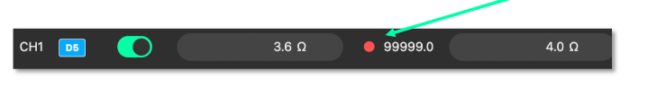

|

5.5.6. Speaker Check Indicator AMPS Section 
*******************************************

Speaker Check can be performed on all activated and defined LINUS14 and LINUS12C devices which are connected to the LINUS Control Network.
In the AMPS section you can take a global measurement by pressing the reload |refresh| button.

|

.. note::
    Speaker Check performs a global measurement on all amplifiers at the same time (one by one, each activated channel requires a maximum of four measurements, each channel taking around 3 seconds), independent of whether the channel mutes are activated or not.  We recommend carrying out this global measurement in a time frame where no audience is present and not during a show, as the sine wave signal will be audible on loudspeakers with low frequency output (for example, subs or full-range speakers).

Once the global Speaker Check has been performed, the following indications will be displayed:

Green = all Channels with activated Speaker Check are within the R Min and R Max threshold:

|

Red = One or more channels are out of the defined R Min and R Max threshold values.

This means two possible causes:
    1. The loudspeaker is not connected. (Check the loudspeaker and its connection to the amplifier channel.)
    2. R Result measurement is slightly out of the defined R Min and R Max threshold value.

(Redefine R Min and R Max threshold values.)

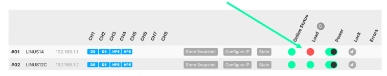

|

.. note::
    Speaker Check setup is stored on each defined amplifier and **not** in the Show File.

5.6. Clear Global 
+++++++++++++++++++
To clear ALL snapshots in ALL online amplifiers on the network, press the “Clear all Snapshots” button, then confirm this action with the confirmation message that pops up. Ensure you wish to do this before confirming.  

|

5.7.  Global set to defaults
++++++++++++++++++++++++++++

On the AMPS page, a button can be found to launch the “Global set to defaults” dialog:

|

When pressed, the following dialog will be presented.  This dialog allows the user to determine which (if any) parameters they would like reset to their default values.  This is particularly useful in touring scenarios, where it is desirable to use the same LINUS Control show file from the previous day, but the tuning data is best to be reset to zero.

Pressing |selectallicon|  will allow all parameters below this to be defaulted, whilst preserving the amplifier names, fallback states, routing and polarity information.

|

5.8. Locking
+++++++++++++

It is possible to lock the Amplifiers from LINUS Control.  There are two levels of locking; 

    • Display Lock prevents casual changes being made to the amplifier’s front panels.  The Display Lock can be reset by pressing both the CH1 select button and the STORE button simultaneously.

    • Unit Lock are there to keep you from making unwanted changes. It allows mutes to be toggled on the front panel, but prevents parameters being changed from the Front Panel.  A password (PIN Code) is needed to unlock the amplifier.  The password can be any number, up to 5 digits long.  The PIN can be entered from either the Front Panel, or from the LINUS Control software.

.. note::
      On LINUS 14 / CON / 10/ 12C, the Display Lock can be reset by pressing both the CH1 select button and the STORE button simultaneously

.. note::
     In the event of the PIN code being lost, please contact techsupport@codaaudio.com detailing the scenario that has led to the loss of the PIN Code, together with information that substantiates your request for the PIN code to be reset, and instructions will be given. In the situation with an installed system, the local distributor / dealer and installation consultants / contractors will be contacted first to establish the authenticity of the PIN code reset.

To access the amplifier locking dialog, press the relevant padlock icon on the amplifier entry on the AMPS page:

|

The following dialog will be shown:

|

Pressing the (Lock) button to the right of the Display Lock text will toggle the display lock state of the relevant amplifier. An ‘L’ or ‘Padlock’ icon will be displayed on the amplifier’s LCD display. 

Pressing the (Lock) button to the right of the Unit Lock text will present the following dialog, where a password can be set. (This should be numeric, of any value from 0 to 99999 inclusively):

|

When the lock is set, the icon will change to (Unlock) shown below:

|

To unlock the amplifier, press this (Unlock) button, then enter the password into the dialog that is presented:

|

6. Tune Page
-------------

6.1. Adjusting Group Parameters
+++++++++++++++++++++++++++++++

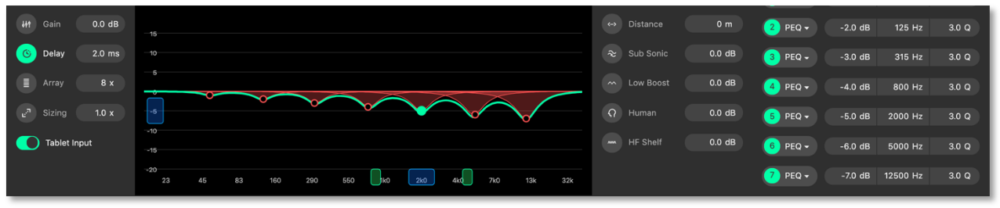

|

All group tuning parameters are enabled and disabled by clicking on the corresponding icon.

A greyed-out icon means the parameter is disabled. A green icon means the parameter is enabled. 

When the filter data is adjusted, the filter will be enabled automatically.

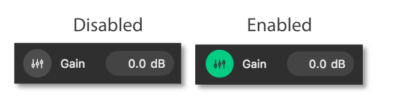

|

6.2.  Absolute vs Relative Filters 
++++++++++++++++++++++++++++++++++

When a Loudspeaker is assigned to more than one group, an absolute filter can only be active in one group. A relative filter can be active in all groups with the output being the sum of all assigned groups.

.. list-table::
    :widths: 50 50
    :header-rows: 1
    :align: center

    * - Absolute Filters
      - Relative Filters
    
    * - Array
      - Gain
    
    * - Sizing
      - Delay
    
    * - Distance
      - Human

    * - Subsonic
      - HF Shelf

    * - Low Boost
      - 
    
    * - PEQ’s
      - 

6.2.1. Gain  
************
The relative gain of the assigned loudspeakers can be adjusted from +12db to -99db.

6.2.2. Delay  
************

The relative delay of the assigned loudspeakers can be perfected for time alignment, and each can be adjusted from 0mS to 1000mS. 
(0 to 200mS in the case of LINUS5-C or LINUS10-C).

6.2.3. Array Filter  
*******************

When Line Array loudspeakers are assigned to the group, the absolute Array value can be adjusted from 4x to 20x. 
This can only be active within one group per loudspeaker.

6.2.4. Sizing Filter  
********************
The absolute sizing of the assigned loudspeaker can be adjusted from 0.5x to 2.0x. 
This can only be active within one group per loudspeaker.

6.2.5. Distance Filter
**********************
The absolute distance value for the assigned loudspeakers can be adjusted from 0m to 100m. 
This can only be active within one group per loudspeaker.

6.2.6. Subsonic Filter
**********************

The absolute level of the subsonic filter which can be adjusted from +12db to -20db. 
This can only be active within one group per loudspeaker.

6.2.7. Low Boost Filter
************************
The absolute level of the low boost filter which can be adjusted from +12db to -20db. 
This can only be active within one group per loudspeaker.

6.2.8. Human Filter 
*******************
The relative level of the human filter which can be adjusted from +12db to -20db.

6.2.9. HF Shelf Filter
**********************
The relative level of the HF shelf filter which can be adjusted from +12db to -20db.

6.2.10. PEQs
*************
There are a total of 7 equalisers to perfect the frequency response of a loudspeaker (4 EQs if using a LINUS10-C or LINUS5-C Amplifier), these can be utilised throughout any of the assigned groups. 

    • Only EQ’s that have not been enabled in another group can be used. 
    • An already enabled EQ in another group will be greyed out.
    • Additional EQ’s can be added by clicking the Add equaliser button.

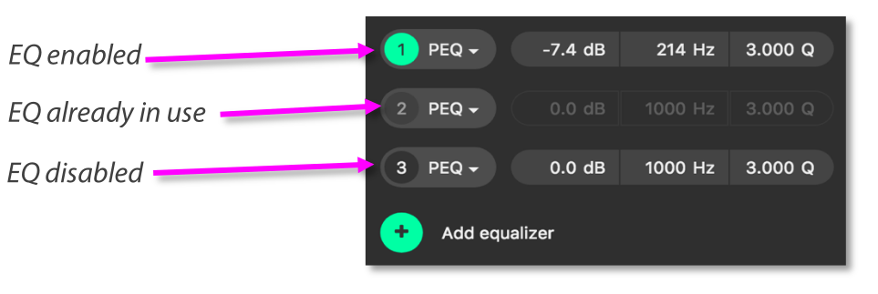

|

6.2.11. PEQ Modes
*****************

You can further tailor your sound with EQ. All 7 equalisers can be changed between parametric, high self and low shelf. 
Clicking on the dropdown arrow displays the three options, plus the ability to delete the filter.

|

6.2.12. Click & Drag EQ Window
*******************************

The gain and frequency of the equaliser can be manipulated by left clicking and dragging the corresponding handle.  The PEQ number and gain value is displayed when the cursor moves over the handle.

|

6.2.13. PEQ Handles
*******************

The filters can be manipulated within the PEQ graph by clicking on the filter point on the PEQ graph, then adjusting the handles that appear. 

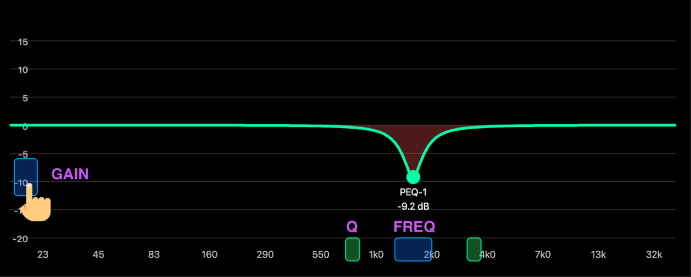

|

7. Monitor Page
----------------
The monitor page provides a detailed view primarily of the metering data for a selected amplifier. By clicking on an amplifier in the workspace the window below will display following:

|

7.1.  Input Meters
++++++++++++++++++
The leftmost 4x meters (2x if LINUS10) are the input meters.
The label underneath each input meter shows you which input is being monitored, and routed to the respective channel. Peak level is shown in the centre, with the calculated effective RMS power level shown either side:

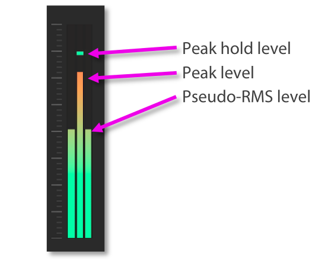

|

If the input meters are hitting the top (turning orange or red), and the loudspeakers are not in gain reduction, it would be best to assess the gain structure of the system to prevent overloading or overshooting the input stage, which can damage speakers. Attenuate the input signal and increase the system gain. We don’t recommend that you clip the analogue inputs, it’s not a sign of intellect!

Amplifier user manuals should be consulted for the latest information, however for reference, the maximum input levels are shown here:

.. list-table::
    :widths: 50 150
    :header-rows: 1
    :align: center

    * - Model
      - Max input level (analogue differential)

    * - LINUS14
      - +18 dBu / 6.15 Vrms / 17.4 Vp-p

    * - LINUS CON
      - +18 dBu / 6.15 Vrms / 17.4 Vp-p
    
    * - LINUS10
      - +21 dBu / 8.69 Vrms / 24.6 Vp-p
    
    * - LINUS12-C
      - +18 dBu / 6.15 Vrms / 17.4 Vp-p

    * - LINUS10-C
      - +15 dBu / 4.36 Vrms / 12.3 Vp-p
    
    * - LINUS5-C
      - +15 dBu / 4.36 Vrms / 12.3 Vp-p

.. note::
    The amplifiers operate internally at 32bit with double precision, which represents a massive internal dynamic range, so it is almost impossible to run out of headroom within the digital signal path inside the amplifier. It would be very beneficial to pay close attention to the gain structure of the system to get the best possible results in each given deployment.

7.2.  Output Meters
+++++++++++++++++++

The output meters are drawn to the right of the monitor window. The output meter comprises three areas, the output level (peak and RMS), the limiter gain reduction activity (peak and thermal) and in the lower section the current indication.

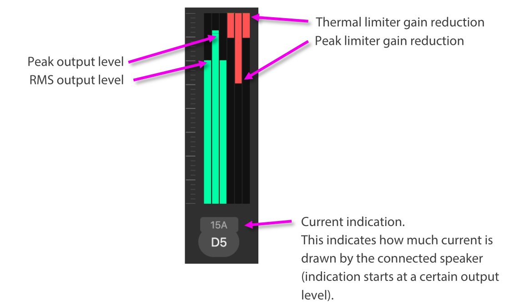

|

7.3.  Group Meters
+++++++++++++++++++

Global input and output meter indication of a group and its assigned channels

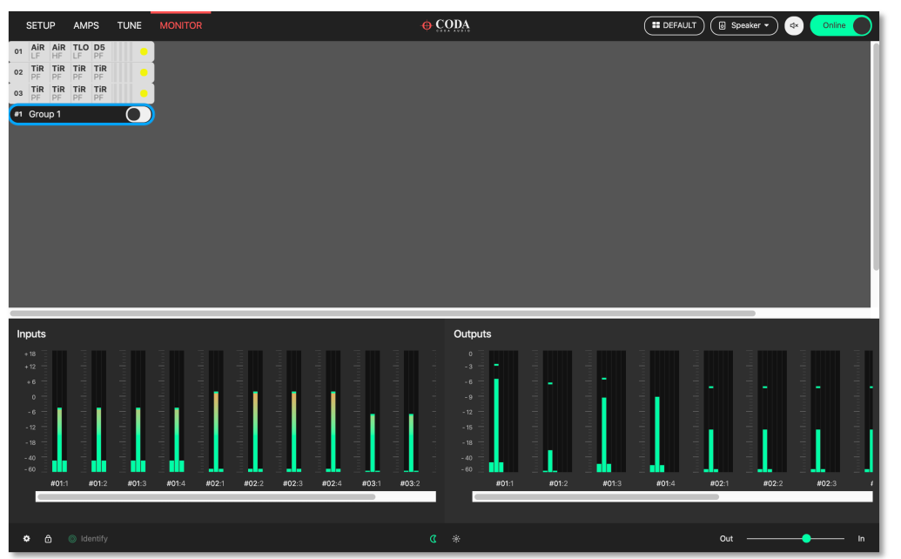

|

8. Amplifier Discovery
----------------------

8.1.  Network Scanning
++++++++++++++++++++++

When LINUS Control is taken Online, it will search for all amplifiers on the network. It will do one of two things with these amplifiers, either mark them as ‘Online’ in the workspace providing certain criteria are met, or place them in the discovery list.

Criteria for marking them as ‘Online’:

    • The ID Matches
    • The Loudspeaker Files match on all channels
    • The Amplifier has not had a snapshot recalled from the Front Panel.

If these tests are all true, it will be marked ‘Online’ and the tuning data presented in the show file (Group Assignments / Gain / Delay / Filters / Routing etc) will be pushed to the Amplifier.

These tests are a fallback, preventing mistakes arising in the operation of the software during a show, which would otherwise result in the changing or loss of audio. Make sure everything goes smoothly during your show.

If any of these tests are not carried out, the Amplifier will be put in the ‘discovery list’. The presence of amplifiers in the ‘discovery list’ is announced in the bottom taskbar.  Clicking the icon will result in the ‘discovery list’ being displayed.

.. image:: assets/images/operation_manual/8/amplifierdiscovered.png
    :align: center

|

Click the “Amplifiers Discovered” annunciation to see the discovery list:

|

The “add all to workspace” button will add the amplifiers that were discovered on the network to the workspace. As the confirmation popup dialog suggests, this will clear the amplifier's active state and mute the outputs.

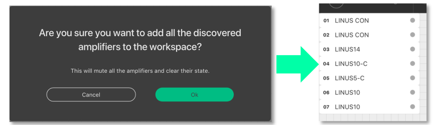

|

The “Conform All” button will replace all amplifiers of a given ID within the workspace with amplifiers in the discovery list with the same ID, if the amplifier in the workspace has loudspeakers assigned that are compatible with the amplifier in the discovery list.

8.2.  ID Conflicts
+++++++++++++++++++

If there are one or more amplifiers in the discovery list that fail one or more of the tests described in section 8.1, an ID conflict is recognised.  In this instance, it is not possible to ‘Add all to workspace’.  Instead you have two choices:

    • Add more substitute ‘virtual’ amplifiers to the workspace, then replace the discovered ones with these, or:
    • Replace one of the amplifiers discovered with another one already in the workspace.

|

8.3.  Matching the discovery list with the workspace
++++++++++++++++++++++++++++++++++++++++++++++++++++

In this example, we have two virtual amplifiers in the workspace, which we want to replace with amplifiers found on the network.  Go Online, then Click the discovery list button in the bottom taskbar:

|

The discovery list is now open & we can see the two amplifiers that were found on the network.  Press the circle on the left of the amplifier in the discovery list that you wish to use as the replacement.

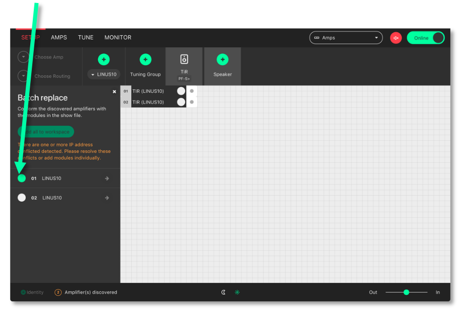

|

Select the destination amplifier in the workspace that you would like the replacement in the discovery list to take over from.  This amplifier can either be virtual, or online.  If it is an online amplifier that is chosen as the destination, after the replacement is confirmed, this amplifier will itself then return to the discovery list. 

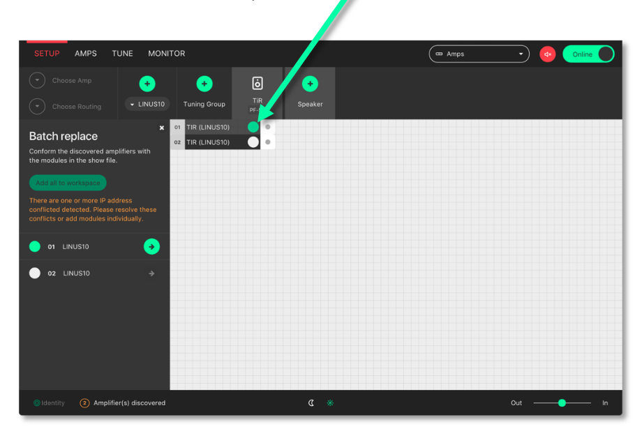

|

Press the ‘arrow’ button to confirm and complete the replacement

|

8.4.  Autosave
+++++++++++++++

An autosave function keeps your tweaks and changes safe. Show files will also be autosaved to the user’s home directory in a folder called \LINUS Control every 10 minutes.  A new file is created periodically, every 10 minutes.
 
We recommend that you do not solely rely on these autosaved files, take manual backups of the show file at key times during the working day, the same as you would for mixing consoles or other equipment, this will mitigate against any possible downtime or other outages. 

8.5.  State Manager
+++++++++++++++++++

The entire LINUS Control file can be stored within the amplifier(s) on the network themselves, then recalled at a later date. This enables the user to recall the state of the network to a completely new machine, without having access to a LINUS Control file. The entire state of the LINUS Control file is stored, not just the individual amplifier’s parameters within this file, and it is possible to recover the entire show file comprising all 250 amplifier’s worth of data, tuning group, and more from just one amplifier.

The state is stored to the online amplifier(s) from the AMPS Page.
The state is recalled from an amplifier, either from the discovery list, or from the AMPS Page.
 
.. note::
    The storing of the state is a manual operation that should be performed when the system engineer or commissioning individual is happy with the current state of the system. Storing the state interrupts the audio signal briefly, so should not be performed during a show.

The current state stored within an online Amplifier is shown on the AMPS page.  If the state that is stored within the Amplifier matches exactly that of the current state of LINUS Control, the state name is shown with a blue background, and with a ‘tick’ mark next to it:

|

Otherwise, the state will be shown in grey, without the ‘tick’ mark:

|

In all cases, whenever there is a state stored within the amplifier, the name of the state is stored within the ‘State’ button, and the date and time of the store is shown to the right of this. 

To store the state of the LINUS Control file to an amplifier, click the State button on the AMPS page; this will present the “State Manager” dialog. You will either be able to store the state to just the one device, or to all devices globally.  The picture below shows an amplifier that does not already contain a state:

|

The picture below shows an amplifier that contains an example state, entitled “My State”, stored on March the 24th 2021 at 14:38. It also shows that this state was stored with LINUS Control v2.2:

|

Clicking & confirming the ‘Clear state’ button, will clear the state from that individual amplifier. 

Clicking the ‘Store state’ or ‘Store global state’ button will present the following dialog, where you can enter a name for the state store. You will also see a reminder that continuing by clicking ‘Store state’ will mute audio for a moment, whilst the operation is invoked.

|

As mentioned previously, the state can either be recalled from one of the amplifiers in the AMPS page, or from the discovery list, from an amplifier that is not yet in the workspace:

|

9. Reference - Amplifier Icons
------------------------------

    • The Amplifier icon is divided into three areas. 
    • These areas are independent of each other. 
    • Network related indications are on the left (Network Area). 
    • The amp ID number is always displayed here.
    • Input signal format and signal related events are on the right (Input Signal Area)
    • The middle (Detail) area in the amplifier is where conditions are displayed, depending on the user's choice from a dropdown menu in the host program. 

|

|

|

|

|

10. References – Keyboard Shortcuts
------------------------------------

Keyboard shortcuts have been implemented to enable the user to reach the required screen as fast as possible. The shortcuts are disabled when typing values into either name fields or numerical fields. 

+---------------------------------------------------------------------+------------------+
| Action                                                              | Shortcut         |
+=====================================================================+==================+
| Amplifier detail view / display amplifier type                      | 1                |
+---------------------------------------------------------------------+------------------+
| Amplifier detail View / display amplifier ID and IP address         | 2                |
+---------------------------------------------------------------------+------------------+
| Amplifier detail View / display amplifier name                      | 3                |
+---------------------------------------------------------------------+------------------+
| Amplifier detail View / display output loudspeaker assignments      | 4                |
+---------------------------------------------------------------------+------------------+
| Amplifier detail View / display amplifier input routing and levels  | 5                |
+---------------------------------------------------------------------+------------------+
| Amplifier detail View / display mute buttons and output levels      | 6                |
+---------------------------------------------------------------------+------------------+
| Amplifier detail View / display the output channel combined gain    | 7                |
+---------------------------------------------------------------------+------------------+
| Amplifier detail View / display the output channel combined delay   | 8                |
+---------------------------------------------------------------------+------------------+
| Workspace view / setup page                                         | S                |
+---------------------------------------------------------------------+------------------+
| Workspace view / amplifier page                                     | A                |
+---------------------------------------------------------------------+------------------+
| Workspace view / tuning page                                        | T                |
+---------------------------------------------------------------------+------------------+
| Workspace view / monitor page                                       | M                |
+---------------------------------------------------------------------+------------------+
| Add Amplifier to workspace                                          | Cmd + F          |
+---------------------------------------------------------------------+------------------+
| Add Group to workspace                                              | Cmd + G          |
+---------------------------------------------------------------------+------------------+
| Select all items in workspace                                       | Cmd + A          |
+---------------------------------------------------------------------+------------------+
| Delete selected item                                                | Backspace / Del  |
+---------------------------------------------------------------------+------------------+
