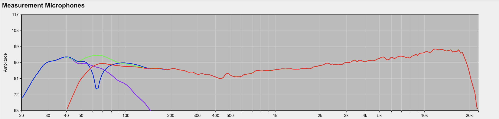

Time Alignment Guide
====================

1. General
-----------
Perfect CODA performance comes from time alignment, it is crucial that all the different parts of the system are optimised to work together for a natural, crystal clear sound.  This relies on the process of ‘time alignment’.  This should be considered as integral to the successful deployment of the system, including the placement of loudspeakers and their splay angles.

For the very best results, it is beneficial to use acoustic measurement software to achieve this. If you don’t have access to such software, you can simply use the figures specified within this document as a starting point for the system deployment. 

.. note::
    Even when specialised acoustic measurement software is used, the system engineer should thoroughly understand the theory of this alignment methodology provided here and should commit coplanar alignment delays of their commonly used system combinations to memory.  Over time, these figures will act as a cross-reference or validation of the software-determined delay time, to ensure errors are not made.

1.1. Example 1 – Coplanar Deployment
+++++++++++++++++++++++++++++++++++++

When two loudspeakers are mounted with their front grilles ‘flush’ to each other in the vertical domain [for example as shown in Figure 1], they are said to be ‘coplanar’. 
Coplanar alignment delay is required to achieve optimum coupling.

.. Figure 1 – example coplanar alignment]

|

In this example, there is 1x AiRAY stacked on top of 1x SCV-F (using an AGA adapter). 
This document should now be consulted to determine the coplanar alignment delay required to achieve optimum coupling. 

Page 11 shows the SCV-F requires 7.1ms added to it. An excerpt of page 11 is shown here:

.. list-table::
   :widths: 25 25 25
   :header-rows: 1
   :align: center

   * - Preset
     - Coplanar alignment delay
     - 

   * - [AiRAY] + [SCV Omni70]
     - AiRAY = 0.0 ms
     - SCV = 7.1 ms
     
    
Without this coplanar alignment delay added, the frequency response will be drastically affected.  The two elements will effectively be ‘working against each other’ where they overlap. 

The graph below [Figure 2] shows the difference in frequency response (measured at 10m on-axis) with and without this coplanar alignment delay added.  

There is no other tuning other than this delay applied. 

It can be seen that without the delay, there is a cancellation at 63Hz: 

.. Figure 2 – Frequency Response with & without coplanar alignment delay

|

+--------+--------------------------------------------+
| Trace  | Explanation                                |
+========+============================================+
| Red    | 1x AiRAY @ 10m                             |
+--------+--------------------------------------------+
| Purple | 1x SCV-F @ 10m                             |
+--------+--------------------------------------------+
| Blue   | AiRAY + SCV-F @10m – no alignment delay    |
+--------+--------------------------------------------+
| Green  | AiRAY + SCV-F @10m – with 7.1ms on SCV-F.  |
+--------+--------------------------------------------+

.. note::
    with all CODA loudspeakers, it should never be necessary to invert the polarity of any loudspeaker.

2.2.  Example 2 – Flown system deployment
+++++++++++++++++++++++++++++++++++++++++

In the following example, 8x TiRAY are flown above 2x U4 subwoofers [Figure 3].

To determine how to time-align this system without the use of acoustic measurement software, it is necessary to do the following:

    • Determine the coplanar alignment delay.
    • Determine the geometric alignment delay.
    • Add the coplanar alignment delay to the geometric delay & normalise if required.

.. Figure 3 – example flown system

|

2.2.1. Determining the coplanar alignment delay
************************************************

As a first step in this example, we will assume the TiRAY and the U4 are coplanar & determine the coplanar alignment delay required between them.  

With reference to the table on page 14, it can be seen that there are two available options for the U4 – a 100Hz LPF, or a 130Hz LPF.

+-------------------------+------------------------------------------+
| Preset                  | Coplanar alignment delay                 |
+=========================+===========================+==============+
| [TiRAY] + [U4 Omni100]  | TiRAY = 0.0 ms            | U4 = 2.0 ms  |
+-------------------------+---------------------------+--------------+
| [TiRAY] + [U4 Omni130]  | TiRAY = 0.0 ms            | U4 = 2.8 ms  |
+-------------------------+---------------------------+--------------+

We shall elect to use the 100Hz U4 preset [U4 Omni100]. 
In this case, the U4 requires 2.0 ms coplanar alignment delay.

2.2.2. Determining the geometric alignment delay
************************************************

Now we shall consider that the TiRAY and the U4 are not coplanar, so it is now necessary to work out the geometric alignment delay required.

2.2.3.  Determine the room length:
**********************************

Measure from the front face of the U4 subwoofers to the rear wall. 
In this example, this is 12.0 m.

2.2.4. Determine the reference position:
*****************************************

This is the position where we will be aligning the U4’s to the TiRAY. 
As a general guideline, we will define the reference position as two-thirds of the way along the length of the room. 

This is 8.0 m from the front face of the U4’s.

.. note::
    it is outside the scope of this document to explain all considerations of reference position for sub to array alignment, but by simply following the 2/3’s guideline, the system will be optimised in the majority of simple cases. 

|

2.2.5. Measure the distance to the acoustic centre of the flown TiRAY:
***********************************************************************

Use a laser rangefinder or a tape-measure to determine the distance of the ‘acoustic centre’ of the TiRAY to the reference position.  
In this example, it is **7.4 m**:

|

.. note:: 
    The acoustic centre for most line arrays can just be thought of as the vertical centre of the line array.

2.2.6. Measure the distance to the front of the U4 subwoofers to the reference position:
*****************************************************************************************

Use a laser rangefinder or a tape-measure to determine the distance of the U4 subwoofers to the reference position. 
In this example, it is **8.0 m**.

|

2.2.7. Determine the geometric alignment delay:
************************************************

So far, we have determined:

Reference to TiRAY 	= 7.4 m

Reference to U4s 	= 8.0 m

To determine the geometric alignment delay, the following formula should be used:

.. note::
    343 is the speed of sound at 20ºC in dry air. 

.. math::

  Geometric Alignment Delay[ms] = \frac{[Distance to U4 right ] -[Distance to TiRAY)]}{343}*1000

So:

.. math::

    Geometric Alignment Delay[ms] = \frac{([8.0] -[7.4] )}{343}*1000

.. math::
    Geometric Alignment Delay=1.75 ms

2.2.8.  Add the coplanar alignment delay to the geometric alignment delay:
**************************************************************************

+-----------------------------+----------+---------+
| Item                        | TiRAY    | U4      |
+=============================+==========+=========+
| Coplanar alignment delay    | 0.0 ms   | 2.0 ms  |
+-----------------------------+----------+---------+
| Geometric alignment delay   | 1.75 ms  | 0.0 ms  |
+-----------------------------+----------+---------+
| Totals:                     | 1.75 ms  | 2.0 ms  |
+-----------------------------+----------+---------+

.. note::
    These values should now be normalised down to zero, as there is no point in delaying both the TiRAY and the U4’s.  Simply subtract the smaller term from the bigger term on both sides. Normalisation will not always be needed, for instance in the case of the coplanar and geometric alignment delay both applying to the same loudspeaker.

It can therefore be determined that the U4 subs should have **0.25 ms** delay applied.

2. Low Frequency Extensions
----------------------------

Low frequency extensions are inherently time aligned to their respective line array enclosure. 

No alignment delay is required between the line array elements and their low frequency extension, providing they are flown in the same line.

Below is a table which details these pairings:

+--------------------------+--------------------+
| Low Frequency Extension  | Aligned to         |
+==========================+====================+
| SC2-F                    |AiRAY, CiRAY, ViRAY |
+--------------------------+--------------------+
| SCN-F                    | N-RAY              |
+--------------------------+--------------------+
| SC3-F                    | LA12               |
+--------------------------+--------------------+
| TiLOW                    | TiRAY              |
+--------------------------+--------------------+

.. note::
    The preset entitled “SC2 Fly Behind” should be used whenever the SC2 Low Frequency Extension is used behind AiRAY or ViRAY. This preset is electronically identical to that of the standard SC2 preset, however it has all pre-alignment delay removed, to save having to add excessive delay to the AiRAY or ViRAY flown in front of it. Please use acoustic measurement software to ensure phase alignment when using this preset, as the alignment depends purely on the distance between the AiRAY / ViRAY and the SC2-F arrays.

3. Coplanar Alignment Delays – Line Arrays
------------------------------------------

3.1. AiRAY
++++++++++

**SCP**

+------------------------------+-------------------------------------------+
| Preset                       | Coplanar alignment delay                  |
+==============================+===========================+===============+
| [AiRAY] + [SCP Omni70]       | AiRAY = 0.0 ms            | SCP = 7.1 ms  |
+------------------------------+---------------------------+---------------+
| [AiRAY] + [SCP Cardio70]     | AiRAY = 0.0 ms            | SCP = 0.1 ms  |
+------------------------------+---------------------------+---------------+
| [AiRAY] + [SCP Cardio70X]    | AiRAY = 0.0 ms            | SCP = 7.1 ms  |
+------------------------------+---------------------------+---------------+
| [AiRAY >>] + [SCP Omni70]    | AiRAY >> = 0.0 ms         | SCP = 1.6 ms  |
+------------------------------+---------------------------+---------------+
| [AiRAY >>] + [SCP Cardio70]  | AiRAY >> = 5.4 ms         | SCP = 0.0 ms  |
+------------------------------+---------------------------+---------------+
| [AiRAY >>] + [SCP Cardio70X] | AiRAY >> = 0.0 ms         | SCP = 1.6 ms  |
+------------------------------+---------------------------+---------------+

**SCV**

+------------------------------+-------------------------------------------+
| Preset                       | Coplanar alignment delay                  |
+==============================+===========================+===============+
| [AiRAY] + [SCV Omni70]       | AiRAY = 0.0 ms            | SCV = 7.1 ms  |
+------------------------------+---------------------------+---------------+
| [AiRAY] + [SCV Cardio70]     | AiRAY = 0.0 ms            | SCV = 0.9 ms  |
+------------------------------+---------------------------+---------------+
| [AiRAY] + [SCV Cardio70X]    | AiRAY = 0.0 ms            | SCV = 7.1 ms  |
+------------------------------+---------------------------+---------------+
| [AiRAY >>] + [SCV Omni70]    | AiRAY >> = 0.0 ms         | SCV = 1.6 ms  |
+------------------------------+---------------------------+---------------+
| [AiRAY >>] + [SCV Cardio70]  | AiRAY >> = 4.6 ms         | SCV = 0.0 ms  |
+------------------------------+---------------------------+---------------+
| [AiRAY >>] + [SCV Cardio70]  | AiRAY >> = 0.0 ms         | SCV = 1.6 ms  |
+------------------------------+---------------------------+---------------+

**SC2 >>**

+------------------------+----------------------------------------------+
| Preset                 | Coplanar alignment delay                     |
+========================+===========================+==================+
| [AiRAY >>] + [SC2 >>]  | AiRAY >> = 1.3 ms         | SC2 >> = 0.0 ms  |
+------------------------+---------------------------+------------------+

.. note::
    Presets with a double chevron ‘>>’ are minimal latency presets, which should be used with care. 
    Do not mix minimal latency and standard presets within the same system, or phase compatibility will not be attained. If in doubt, do not use the minimal latency presets to ensure compatibility.

3.2. CiRAY
++++++++++

**SCP**

+---------------------------+-----------------------------------------+
| Preset                    | Coplanar alignment delay                |
+===========================+==========================+==============+
| [CiRAY] + [SCP Omni70]    | CiRAY = 0.0 ms           | SCP = 7.1 ms |
+---------------------------+--------------------------+--------------+
| [CiRAY] + [SCP Cardio70]  | CiRAY = 0.0 ms           | SCP = 0.1 ms |
+---------------------------+--------------------------+--------------+
| [CiRAY] + [SCP Cardio70X] | CiRAY = 0.0 ms           | SCP = 7.1 ms |
+---------------------------+--------------------------+--------------+

**SCV**

+---------------------------+-----------------------------------------+
| Preset                    | Coplanar alignment delay                |
+===========================+==========================+==============+
| [CiRAY] + [SCV Omni70]    | CiRAY = 0.0 ms           | SCV = 7.1 ms |
+---------------------------+--------------------------+--------------+
| [CiRAY] + [SCV Cardio70]  | CiRAY = 0.0 ms           | SCV = 0.9 ms |
+---------------------------+--------------------------+--------------+
| [CiRAY] + [SCV Cardio70X] | CiRAY = 0.0 ms           | SCV = 7.1 ms |
+---------------------------+--------------------------+--------------+

3.3. ViRAY
+++++++++++

**SC8**

+----------------------------+-------------------------------------------+
| Preset                     | Coplanar alignment delay                  |
+============================+===========================+===============+
| [ViRAY] + [SC8 Cardio100]  | ViRAY = 0.0 ms            | SC8 = 0.8 ms  |
+----------------------------+---------------------------+---------------+

**SCP**

+-------------------------------+-------------------------------------------+
| Preset                        | Coplanar alignment delay                  |
+===============================+===========================+===============+
| [ViRAY] + [SCP Omni100]       | ViRAY = 0.0 ms            | SCP = 7.8 ms  |
+-------------------------------+---------------------------+---------------+
| [ViRAY] + [SCP Cardio100]     | ViRAY = 0.0 ms            | SCP = 0.8 ms  |
+-------------------------------+---------------------------+---------------+
| [ViRAY] + [SCP Cardio100X]    | ViRAY = 0.0 ms            | SCP = 7.8 ms  |
+-------------------------------+---------------------------+---------------+
| [ViRAY >>] + [SCP Omni100]    | ViRAY >> = 0.0 ms         | SCP = 2.3 ms  |
+-------------------------------+---------------------------+---------------+
| [ViRAY >>] + [SCP Cardio100]  | ViRAY >> = 4.7 ms         | SCP = 0.0 ms  |
+-------------------------------+---------------------------+---------------+
| [ViRAY >>] + [SCP Cardio100X] | ViRAY >> = 0.0 ms         | SCP = 2.3 ms  |
+-------------------------------+---------------------------+---------------+

**SCV**

+-------------------------------+-------------------------------------------+
| Preset                        | Coplanar alignment delay                  |
+===============================+===========================+===============+
| [ViRAY] + [SCV Omni100]       | ViRAY = 0.0 ms            | SCV = 7.8 ms  |
+-------------------------------+---------------------------+---------------+
| [ViRAY] + [SCV Cardio100]     | ViRAY = 0.0 ms            | SCV = 1.6 ms  |
+-------------------------------+---------------------------+---------------+
| [ViRAY] + [SCV Cardio100X]    | ViRAY = 0.0 ms            | SCV = 7.8 ms  |
+-------------------------------+---------------------------+---------------+
| [ViRAY >>] + [SCV Omni100]    | ViRAY >> = 0.0 ms         | SCV = 2.3 ms  |
+-------------------------------+---------------------------+---------------+
| [ViRAY >>] + [SCV Cardio100]  | ViRAY >> = 3.9 ms         | SCV = 0.0 ms  |
+-------------------------------+---------------------------+---------------+
| [ViRAY >>] + [SCV Cardio100X] | ViRAY >> = 0.0 ms         | SCV = 2.3 ms  |
+-------------------------------+---------------------------+---------------+

**SC2 >>**

+------------------------+----------------------------------------------+
| Preset                 | Coplanar alignment delay                     |
+========================+===========================+==================+
| [ViRAY >>] + [SC2 >>]  | ViRAY >> = 0.0 ms         | SC2 >> = 0.0 ms  |
+------------------------+---------------------------+------------------+

.. note::
    Presets with a double chevron ‘>>’ are minimal latency presets, which should be used with care. 
    
    Do not mix minimal latency and standard presets within the same system, or phase compatibility will not be attained. If in doubt, do not use the minimal latency presets to ensure compatibility.

3.3. N-RAY
+++++++++++

**SCP**

+-----------------------------+-------------------------------------------+
| Preset                      | Coplanar alignment delay                  |
+=============================+===========================+===============+
| [N-RAY] + [SCP Omni70]      | N-RAY = 0.0 ms            | SCP = 7.0 ms  |
+-----------------------------+---------------------------+---------------+
| [N-RAY] + [SCP Cardio70]    | N-RAY = 0.0 ms            | SCP = 0.0 ms  |
+-----------------------------+---------------------------+---------------+
| [N-RAY] + [SCP Cardio70X]   | N-RAY = 0.0 ms            | SCP = 7.0 ms  |
+-----------------------------+---------------------------+---------------+
| [N-RAY] + [SCP Omni100]     | N-RAY = 0.0 ms            | SCP = 8.5 ms  |
+-----------------------------+---------------------------+---------------+
| [N-RAY] + [SCP Cardio100]   | N-RAY = 0.0 ms            | SCP = 1.5 ms  |
+-----------------------------+---------------------------+---------------+
| [N-RAY] + [SCP Cardio100X]  | N-RAY = 0.0 ms            | SCP = 8.5 ms  |
+-----------------------------+---------------------------+---------------+

**SCV**

+-----------------------------+-------------------------------------------+
| Preset                      | Coplanar alignment delay                  |
+=============================+===========================+===============+
| [N-RAY] + [SCV Omni70]      | N-RAY = 0.0 ms            | SCV = 7.0 ms  |
+-----------------------------+---------------------------+---------------+
| [N-RAY] + [SCV Cardio70]    | N-RAY = 0.0 ms            | SCV = 0.0 ms  |
+-----------------------------+---------------------------+---------------+
| [N-RAY] + [SCV Cardio70X]   | N-RAY = 0.0 ms            | SCV = 7.0 ms  |
+-----------------------------+---------------------------+---------------+
| [N-RAY] + [SCV Omni100]     | N-RAY = 0.0 ms            | SCV = 8.5 ms  |
+-----------------------------+---------------------------+---------------+
| [N-RAY] + [SCV Cardio100]   | N-RAY = 0.0 ms            | SCV = 1.5 ms  |
+-----------------------------+---------------------------+---------------+
| [N-RAY] + [SCV Cardio100X]  | N-RAY = 0.0 ms            | SCV = 8.5 ms  |
+-----------------------------+---------------------------+---------------+

**SCN Cardio X**

+---------------------------+-------------------------------------------+
| Preset                    | Coplanar alignment delay                  |
+===========================+===========================+===============+
| [N-RAY] + [SCN Cardio X]  | N-RAY = 0.0 ms            | SCN = 7.1 ms  |
+---------------------------+---------------------------+---------------+

**SCN >>**

+------------------------+----------------------------------------------+
| Preset                 | Coplanar alignment delay                     |
+========================+===========================+==================+
| [N-RAY >>] + [SCN >>]  | N-RAY >> = 0.0 ms         | SCN >> = 2.0 ms  |
+------------------------+---------------------------+------------------+

.. note::
    Presets with a double chevron ‘>>’ are minimal latency presets, which should be used with care. 

    Do not mix minimal latency and standard presets within the same system, or phase compatibility will not be attained. If in doubt, do not use the minimal latency presets to ensure compatibility.

3.4. TiRAY
+++++++++++

**SCP**

+------------------------------+-------------------------------------------+
| Preset                       | Coplanar alignment delay                  |
+==============================+===========================+===============+
| [TiRAY >] + [SCP Omni100]    | TiRAY = 0.0 ms            | SCP = 1.0 ms  |
+------------------------------+---------------------------+---------------+
| [TiRAY >] + [SCP Cardio100]  | TiRAY = 6.0ms             | SCP = 0.0 ms  |
+------------------------------+---------------------------+---------------+
| [TiRAY >] + [SCP Cardio100X] | TiRAY = 0.0ms             | SCP = 1.0 ms  |
+------------------------------+---------------------------+---------------+

**SCV**

+------------------------------+-------------------------------------------+
| Preset                       | Coplanar alignment delay                  |
+==============================+===========================+===============+
| [TiRAY >] + [SCV Omni100]    | TiRAY = 0.0 ms            | SCV = 1.0 ms  |
+------------------------------+---------------------------+---------------+
| [TiRAY >] + [SCV Cardio100]  | TiRAY = 5.2 ms            | SCV = 0.0ms   |
+------------------------------+---------------------------+---------------+
| [TiRAY >] + [SCV Cardio100X] | TiRAY = 0.0 ms            | SCV = 1.0ms   |
+------------------------------+---------------------------+---------------+

**SC4**

+----------------------------+-------------------------------------------+
| Preset                     | Coplanar alignment delay                  |
+============================+===========================+===============+
| [TiRAY >] + [SC4 Omni100]  | TiRAY = 0.0 ms            | SC4 = 1.3 ms  |
+----------------------------+---------------------------+---------------+

**G15**

+----------------------------+-------------------------------------------+
| Preset                     | Coplanar alignment delay                  |
+============================+===========================+===============+
| [TiRAY >] + [G15 Omni100]  | TiRAY = 3.0 ms            | G15 = 0.0 ms  |
+----------------------------+---------------------------+---------------+
| [TiRAY >] + [G15 Omni130]  | TiRAY = 0.0 ms            | G15 = 3.6 ms  |
+----------------------------+---------------------------+---------------+

**U15**

+----------------------------+-------------------------------------------+
| Preset                     | Coplanar alignment delay                  |
+============================+===========================+===============+
| [TiRAY >] + [U15 Omni100]  | TiRAY = 3.0 ms            | U15 = 0.0 ms  |
+----------------------------+---------------------------+---------------+
| [TiRAY >] + [U15 Omni130]  | TiRAY = 0.0 ms            | U15 = 3.6 ms  |
+----------------------------+---------------------------+---------------+

**G18**

+----------------------------+-------------------------------------------+
| Preset                     | Coplanar alignment delay                  |
+============================+===========================+===============+
| [TiRAY >] + [G18 Omni100]  | TiRAY = 0.0 ms            | G18 = 1.9 ms  |
+----------------------------+---------------------------+---------------+

**U4**

+---------------------------+------------------------------------------+
| Preset                    | Coplanar alignment delay                 |
+===========================+===========================+==============+
| [TiRAY >] + [U4 Omni100]  | TiRAY = 0.0 ms            | U4 = 2.0 ms  |
+---------------------------+---------------------------+--------------+
| [TiRAY >] + [U4 Omni130]  | TiRAY = 0.0 ms            | U4 = 2.8 ms  |
+---------------------------+---------------------------+--------------+

**PW418**

+------------------------------+---------------------------------------------+
| Preset                       | Coplanar alignment delay                    |
+==============================+===========================+=================+
| [TiRAY >] + [PW418 Omni100]  | TiRAY = 0.0 ms            | PW418 = 1.9 ms  |
+------------------------------+---------------------------+-----------------+

3.5. LA4
+++++++++

**U4**

+-----------------------+------------------------------------------+
| Preset                | Coplanar alignment delay                 |
+=======================+===========================+==============+
| [LA4] + [U4 Omni100]  | LA4 = 0.0 ms              | U4 = 7.8 ms  |
+-----------------------+---------------------------+--------------+
| [LA4] + [U4 Omni130]  | LA4 = 0.0 ms              | U4 = 8.6 ms  |
+-----------------------+---------------------------+--------------+

3.6. LA8
+++++++++

**SC8**

+--------------------------+-------------------------------------------+
| Preset                   | Coplanar alignment delay                  |
+==========================+===========================+===============+
| [LA8] + [SC8 Cardio100]  | LA8 = 0.8 ms              | SC8 = 0.0 ms  |
+--------------------------+---------------------------+---------------+

**SCP**

+--------------------------+-------------------------------------------+
| Preset                   | Coplanar alignment delay                  |
+==========================+===========================+===============+
| [LA8] + [SCP Omni100]    | LA8 = 0.0 ms              | SCP = 6.4 ms  |
+--------------------------+---------------------------+---------------+
| [LA8] + [SCP Cardio100]  | LA8 = 0.6 ms              | SCP = 0.0 ms  |
+--------------------------+---------------------------+---------------+
| [LA8] + [SCP Cardio100X] | LA8 = 0.0 ms              | SCP = 6.4 ms  |
+--------------------------+---------------------------+---------------+

**SCV**

+--------------------------+-------------------------------------------+
| Preset                   | Coplanar alignment delay                  |
+==========================+===========================+===============+
| [LA8] + [SCV Omni100]    | LA8 = 0.0 ms              | SCV = 6.4 ms  |
+--------------------------+---------------------------+---------------+
| [LA8] + [SCV Cardio100]  | LA8 = 0.0 ms              | SCV = 0.2 ms  |
+--------------------------+---------------------------+---------------+
| [LA8] + [SCV Cardio100X] | LA8 = 0.0 ms              | SCV = 6.4 ms  |
+--------------------------+---------------------------+---------------+

**U4**

+----------------------+------------------------------------------+
| Preset               | Coplanar alignment delay                 |
+======================+===========================+==============+
| [LA8] + [U4 Omni70]  | LA8 = 0.0 ms              | U4 = 5.0 ms  |
+----------------------+---------------------------+--------------+
| [LA8] + [U4 Omni100] | LA8 = 0.0 ms              | U4 = 7.5 ms  |
+----------------------+---------------------------+--------------+

**APS-SUB**

+--------------------+-----------------------------------------------+
| Preset             | Coplanar alignment delay                      |
+====================+===========================+===================+
| [LA8] + [APS-SUB]  | LA8 = 0.0 ms              | APS-SUB = 1.7 ms  |
+--------------------+---------------------------+-------------------+

3.7. LA12
+++++++++

**SC8**

+--------------------------+-------------------------------------------+
| Preset                   | Coplanar alignment delay                  |
+==========================+===========================+===============+
| [LA12] + [SC8 Cardio70]  | LA12 = 0.9 ms             | SC8 = 0.0 ms  |
+--------------------------+---------------------------+---------------+

**SCP**

+--------------------------+-------------------------------------------+
| Preset                   | Coplanar alignment delay                  |
+==========================+===========================+===============+
| [LA12] + [SCP Omni70]    | LA12 = 0.0 ms             | SCP = 6.5 ms  |
+--------------------------+---------------------------+---------------+
| [LA12] + [SCP Cardio70]  | LA12 = 0.5 ms             | SCP = 0.0 ms  |
+--------------------------+---------------------------+---------------+
| [LA12] + [SCP Cardio70X] | LA12 = 0.0 ms             | SCP = 6.5 ms  |
+--------------------------+---------------------------+---------------+

**SCV**

+--------------------------+-------------------------------------------+
| Preset                   | Coplanar alignment delay                  |
+==========================+===========================+===============+
| [LA12] + [SCV Omni70]    | LA12 = 0.0 ms             | SCV = 6.5 ms  |
+--------------------------+---------------------------+---------------+
| [LA12] + [SCV Cardio70]  | LA12 = 0.5 ms             | SCV = 0.0 ms  |
+--------------------------+---------------------------+---------------+
| [LA12] + [SCV Cardio70X] | LA12 = 0.0 ms             | SCV = 6.5 ms  |
+--------------------------+---------------------------+---------------+

4. Coplanar Alignment Delays – APS Series
-----------------------------------------

4.1. APS
+++++++++

**SCP**

+---------------------------+-------------------------------------------+
| Preset                    | Coplanar alignment delay                  |
+===========================+===========================+===============+
| [APS] + [SCP Omni70]      | APS = 0.0 ms              | SCP = 6.5 ms  |
+---------------------------+---------------------------+---------------+
| [APS >] + [SCP Omni70]    | APS = 0.0 ms              | SCP = 3.0 ms  |
+---------------------------+---------------------------+---------------+
| [APS >>] + [SCP Omni70]   | APS = 0.0 ms              | SCP = 2.3 ms  |
+---------------------------+---------------------------+---------------+
| [APS] + [SCP Cardio70]    | APS = 0.0 ms              | SCP = 0.0 ms  |
+---------------------------+---------------------------+---------------+
| [APS >] + [SCP Cardio70]  | APS = 3.2 ms              | SCP = 0.0 ms  |
+---------------------------+---------------------------+---------------+
| [APS >>] + [SCP Cardio70] | APS = 3.9 ms              | SCP = 0.0 ms  |
+---------------------------+---------------------------+---------------+
| [APS] + [SCP Cardio70X]   | APS = 0.0 ms              | SCP = 6.5 ms  |
+---------------------------+---------------------------+---------------+
| [APS >] + [SCP Cardio70X] | APS = 0.0 ms              | SCP = 3.0 ms  |
+---------------------------+---------------------------+---------------+
|[APS >>] + [SCP Cardio70X] | APS = 0.0 ms              | SCP = 2.3 ms  |
+---------------------------+---------------------------+---------------+

**SCV**

+-----------------------------+-------------------------------------------+
| Preset                      | Coplanar alignment delay                  |
+=============================+===========================+===============+
| [APS] + [SCV Omni70]        | APS = 0.0 ms              | SCV = 6.5 ms  |
+-----------------------------+---------------------------+---------------+
| [APS >] + [SCV Omni70]      | APS = 0.0 ms              | SCV = 3.0 ms  |
+-----------------------------+---------------------------+---------------+
| [APS >>] + [SCV Omni70]     | APS = 0.0 ms              | SCV = 2.3 ms  |
+-----------------------------+---------------------------+---------------+
| [APS] + [SCV Cardio70]      | APS = 0.0 ms              | SCV = 0.0 ms  |
+-----------------------------+---------------------------+---------------+
| [APS >] + [SCV Cardio70]    | APS = 3.2 ms              | SCV = 0.0 ms  |
+-----------------------------+---------------------------+---------------+
| [APS >>] + [SCV Cardio70]   | APS = 3.9 ms              | SCV = 0.0 ms  |
+-----------------------------+---------------------------+---------------+
| [APS] + [SCV Cardio70X]     | APS = 0.0 ms              | SCV = 6.5 ms  |
+-----------------------------+---------------------------+---------------+
| [APS >] + [SCV Cardio70X]   | APS = 0.0 ms              | SCV = 3.0 ms  |
+-----------------------------+---------------------------+---------------+
| [APS >>] + [SCV Cardio70X]  | APS = 0.0 ms              | SCV = 2.3 ms  |
+-----------------------------+---------------------------+---------------+

**U4**

+------------------------+------------------------------------------+
| Preset                 | Coplanar alignment delay                 |
+========================+===========================+==============+
| [APS] + [U4 Omni70]    | APS = 0.0 ms              | U4 = 6.5 ms  |
+------------------------+---------------------------+--------------+
| [APS >] + [U4 Omni70]  | APS = 0.0 ms              | U4 = 3.3 ms  |
+------------------------+---------------------------+--------------+
| [APS >>] + [U4 Omni70] | APS = 0.0 ms              | U4 = 2.6 ms  |
+------------------------+---------------------------+--------------+

**APS-SUB**

+----------------------+-----------------------------------------------+
| Preset               | Coplanar alignment delay                      |
+======================+===========================+===================+
| [APS] + [APS-SUB]    | APS = 0.0 ms              | APS-SUB = 3.2 ms  |
+----------------------+---------------------------+-------------------+
| [APS >] + [APS-SUB]  | APS = 0.0 ms              | APS-SUB = 0.0 ms  |
+----------------------+---------------------------+-------------------+
| [APS >>] + [APS-SUB] | APS = 1.5 ms              | APS-SUB = 0.0 ms  |
+----------------------+---------------------------+-------------------+

4.2. N-APS
+++++++++++

**N-SUB**

+----------------------------------------+---------------------------------------------+
| Preset                                 | Coplanar alignment delay                    |
+========================================+===========================+=================+
| [N-APS Crossover] + [N-SUB Omni100]    | N-APS = 0.0 ms            | N-SUB = 4.1 ms  |
+----------------------------------------+---------------------------+-----------------+
| [N-APS Crossover >] + [N-SUB Omni100]  | N-APS = 0.0 ms            | N-SUB = 0.0 ms  |
+----------------------------------------+---------------------------+-----------------+
| [N-APS Crossover >>] + [N-SUB Omni100] | N-APS = 1.9 ms            | N-SUB = 0.0 ms  |
+----------------------------------------+---------------------------+-----------------+

**SCN-F**

+-------------------------------------------+---------------------------------------------+
| Preset                                    | Coplanar alignment delay                    |
+===========================================+===========================+=================+
| [N-APS Crossover ] + [SCN SUB Omni100]    | N-APS = 0.0 ms            | SCN-F = 7.6 ms  |
+-------------------------------------------+---------------------------+-----------------+
| [N-APS Crossover >] + [SCN SUB Omni100]   | N-APS = 0.0 ms            | SCN-F = 3.5 ms  |
+-------------------------------------------+---------------------------+-----------------+
| [N-APS Crossover >>] + [SCN SUB Omni100]  | N-APS = 0.0 ms            | SCN-F = 1.6 ms  |
+-------------------------------------------+---------------------------+-----------------+

5. Coplanar Alignment Delays – HOPS Series
-------------------------------------------

5.1. HOPS12
++++++++++++

**SCP**

+------------------------------------------+-------------------------------------------+
| Preset                                   | Coplanar alignment delay                  |
+==========================================+===========================+===============+
| [HOPS12-Fullrange] + [SCP Omni70]        | HOPS12 = 0.0 ms           | SCP = 6.1 ms  |
+------------------------------------------+---------------------------+---------------+
| [HOPS12-Fullrange] + [SCP Cardio70]      | HOPS12 = 0.8 ms           | SCP = 0.0 ms  |
+------------------------------------------+---------------------------+---------------+
| [HOPS12-Fullrange] + [SCP Cardio70X]     | HOPS12 = 0.0 ms           | SCP = 5.5 ms  |
+------------------------------------------+---------------------------+---------------+
| [HOPS12-Fullrange >] + [SCP Omni70]      | HOPS12 = 0.0 ms           | SCP = 5.5 ms  |
+------------------------------------------+---------------------------+---------------+
| [HOPS12-Fullrange >] + [SCP Cardio70]    | HOPS12 = 1.3 ms           | SCP = 0.0 ms  |
+------------------------------------------+---------------------------+---------------+
| [HOPS12-Fullrange >] + [SCP Cardio70X]   | HOPS12 = 0.0 ms           | SCP = 5.5 ms  |
+------------------------------------------+---------------------------+---------------+
| [HOPS12-Fullrange >>] + [SCP Omni70]     | HOPS12 = 0.0 ms           | SCP = 3.3 ms  |
+------------------------------------------+---------------------------+---------------+
| [HOPS12-Fullrange >>] + [SCP Cardio70]   | HOPS12 = 3.0 ms           | SCP = 0.0 ms  |
+------------------------------------------+---------------------------+---------------+
| [HOPS12-Fullrange >>] + [SCP Cardio70X]  | HOPS12 = 0.0 ms           | SCP = 3.3 ms  |
+------------------------------------------+---------------------------+---------------+

**SCV**

+------------------------------------------+-------------------------------------------+
| Preset                                   | Coplanar alignment delay                  |
+==========================================+===========================+===============+
| [HOPS12-Fullrange] + [SCV Omni70]        | HOPS12 = 0.0 ms           | SCV = 6.1 ms  |
+------------------------------------------+---------------------------+---------------+
| [HOPS12-Fullrange] + [SCV Cardio70]      | HOPS12 = 0.3 ms           | SCV = 0.0 ms  |
+------------------------------------------+---------------------------+---------------+
| [HOPS12-Fullrange] + [SCV Cardio70X]     | HOPS12 = 0.0 ms           | SCV = 5.5 ms  |
+------------------------------------------+---------------------------+---------------+
| [HOPS12-Fullrange >] + [SCV Omni70]      | HOPS12 = 0.0 ms           | SCV = 5.5 ms  |
+------------------------------------------+---------------------------+---------------+
| [HOPS12-Fullrange >] + [SCV Cardio70]    | HOPS12 = 1.0 ms           | SCV = 0.0 ms  |
+------------------------------------------+---------------------------+---------------+
| [HOPS12-Fullrange >] + [SCV Cardio70X]   | HOPS12 = 0.0 ms           | SCV = 5.5 ms  |
+------------------------------------------+---------------------------+---------------+
| [HOPS12-Fullrange >>] + [SCV Omni70]     | HOPS12 = 0.0 ms           | SCV = 3.3 ms  |
+------------------------------------------+---------------------------+---------------+
| [HOPS12-Fullrange >>] + [SCV Cardio70]   | HOPS12 = 2.6 ms           | SCV = 0.0 ms  |
+------------------------------------------+---------------------------+---------------+
| [HOPS12-Fullrange >>] + [SCV Cardio70X]  | HOPS12 = 0.0 ms           | SCV = 3.0 ms  |
+------------------------------------------+---------------------------+---------------+

**U4**

+---------------------------------------+------------------------------------------+
| Preset                                | Coplanar alignment delay                 |
+=======================================+===========================+==============+
| [HOPS12-Fullrange ] + [U4 Omni70]     | HOPS12 = 0.0 ms           | U4 = 7.0 ms  |
+---------------------------------------+---------------------------+--------------+
| [HOPS12-Fullrange >] + [U4 Omni70]    | HOPS12 = 0.0 ms           | U4 = 6.4 ms  |
+---------------------------------------+---------------------------+--------------+
| [HOPS12-Fullrange >>] + [U4 Omni70]   | HOPS12 = 0.0 ms           | U4 = 4.2 ms  |
+---------------------------------------+---------------------------+--------------+

5.2. HOPS12 + Crossover
++++++++++++++++++++++++

**SCP**

+-------------------------------------------+-----------------------------------------+
| Preset                                    | Coplanar alignment delay                |
+===========================================+==========================+==============+
| [HOPS12-Crossover] + [SCP Omni70]         | HOPS12 = 0.0 ms          | SCP = 2.0 ms |
+-------------------------------------------+--------------------------+--------------+
| [HOPS12- Crossover] + [SCP Cardio70]      | HOPS12 = 3.7 ms          | SCP = 0.0 ms |
+-------------------------------------------+--------------------------+--------------+
| [HOPS12- Crossover] + [SCP Cardio70X]     | HOPS12 = 0.0 ms          | SCP = 2.0 ms |
+-------------------------------------------+--------------------------+--------------+
| [HOPS12- Crossover >] + [SCP Omni70]      | HOPS12 = 0.0 ms          | SCP = 2.0 ms |
+-------------------------------------------+--------------------------+--------------+
| [HOPS12- Crossover >] + [SCP Cardio70]    | HOPS12 = 4.2 ms          | SCP = 0.0 ms |
+-------------------------------------------+--------------------------+--------------+
| [HOPS12- Crossover >] + [SCP Cardio70X]   | HOPS12 = 0.0 ms          | SCP = 2.0 ms |
+-------------------------------------------+--------------------------+--------------+
| [HOPS12- Crossover >>] + [SCP Omni70]     | HOPS12 = 0.0 ms          | SCP = 0.7 ms |
+-------------------------------------------+--------------------------+--------------+
| [HOPS12- Crossover >>] + [SCP Cardio70]   | HOPS12 = 5.6 ms          | SCP = 0.0 ms |
+-------------------------------------------+--------------------------+--------------+
| [HOPS12- Crossover >>] + [SCP Cardio70X]  | HOPS12 = 0.0 ms          | SCP = 0.0 ms |
+-------------------------------------------+--------------------------+--------------+
| [HOPS12-Crossover] + [SCP Omni100]        | HOPS12 = 0.0 ms          | SCP = 4.8 ms |
+-------------------------------------------+--------------------------+--------------+
| [HOPS12- Crossover] + [SCP Cardio100]     | HOPS12 = 1.8 ms          | SCP = 0.0 ms |
+-------------------------------------------+--------------------------+--------------+
| [HOPS12- Crossover] + [SCP Cardio100X]    | HOPS12 = 0.0 ms          | SCP = 4.8 ms |
+-------------------------------------------+--------------------------+--------------+
| [HOPS12- Crossover >] + [SCP Omni100]     | HOPS12 = 0.0 ms          | SCP = 4.0 ms |
+-------------------------------------------+--------------------------+--------------+
| [HOPS12- Crossover >] + [SCP Cardio100]   | HOPS12 = 2.2 ms          | SCP = 0.0 ms |
+-------------------------------------------+--------------------------+--------------+
| [HOPS12- Crossover >] + [SCP Cardio100X]  | HOPS12 = 0.0 ms          | SCP = 4.0 ms |
+-------------------------------------------+--------------------------+--------------+
| [HOPS12- Crossover >>] + [SCP Omni100]    | HOPS12 = 0.0 ms          | SCP = 2.7 ms |
+-------------------------------------------+--------------------------+--------------+
| [HOPS12- Crossover >>] + [SCP Cardio100]  | HOPS12 = 4.2 ms          | SCP = 0.0 ms |
+-------------------------------------------+--------------------------+--------------+
| [HOPS12- Crossover >>] + [SCP Cardio100X] | HOPS12 = 0.0 ms          | SCP = 2.7 ms |
+-------------------------------------------+--------------------------+--------------+

**SCV**

+-------------------------------------------+------------------------------------------+
| Preset                                    | Coplanar alignment delay                 |
+===========================================+==========================+===============+
| [HOPS12- Crossover] + [SCV Omni70]        | HOPS12 = 0.0 ms          | SCV = 2.0 ms  |
+-------------------------------------------+--------------------------+---------------+
| [HOPS12- Crossover] + [SCV Cardio70]      | HOPS12 = 3.3 ms          | SCV = 0.0 ms  |
+-------------------------------------------+--------------------------+---------------+
| [HOPS12- Crossover] + [SCV Cardio70X]     | HOPS12 = 0.0 ms          | SCV = 1.8 ms  |
+-------------------------------------------+--------------------------+---------------+
| [HOPS12- Crossover >] + [SCV Omni70]      | HOPS12 = 0.0 ms          | SCV = 2.0 ms  |
+-------------------------------------------+--------------------------+---------------+
| [HOPS12- Crossover >] + [SCV Cardio70]    | HOPS12 = 3.8 ms          | SCV = 0.0 ms  |
+-------------------------------------------+--------------------------+---------------+
| [HOPS12- Crossover >] + [SCV Cardio70X]   | HOPS12 = 0.0 ms          | SCV = 1.8 ms  |
+-------------------------------------------+--------------------------+---------------+
| [HOPS12- Crossover >>] + [SCV Omni70]     | HOPS12 = 0.0 ms          | SCV = 0.7 ms  |
+-------------------------------------------+--------------------------+---------------+
| [HOPS12- Crossover >>] + [SCV Cardio70]   | HOPS12 = 5.2 ms          | SCV = 0.0 ms  |
+-------------------------------------------+--------------------------+---------------+
| [HOPS12- Crossover >>] + [SCV Cardio70X]  | HOPS12 = 0.0 ms          | SCV = 0.0 ms  |
+-------------------------------------------+--------------------------+---------------+
| [HOPS12- Crossover] + [SCV Omni100]       | HOPS12 = 0.0 ms          | SCV = 4.8 ms  |
+-------------------------------------------+--------------------------+---------------+
| [HOPS12- Crossover] + [SCV Cardio100]     | HOPS12 = 1.8 ms          | SCV = 0.0 ms  |
+-------------------------------------------+--------------------------+---------------+
| [HOPS12- Crossover] + [SCV Cardio100X]    | HOPS12 = 0.0 ms          | SCV = 4.0 ms  |
+-------------------------------------------+--------------------------+---------------+
| [HOPS12- Crossover >] + [SCV Omni100]     | HOPS12 = 0.0 ms          | SCV = 4.0 ms  |
+-------------------------------------------+--------------------------+---------------+
| [HOPS12- Crossover >] + [SCV Cardio100]   | HOPS12 = 1.8 ms          | SCV = 0.0 ms  |
+-------------------------------------------+--------------------------+---------------+
| [HOPS12- Crossover >] + [SCV Cardio100X]  | HOPS12 = 0.0 ms          | SCV = 3.4 ms  |
+-------------------------------------------+--------------------------+---------------+
| [HOPS12- Crossover >>] + [SCV Omni100]    | HOPS12 = 0.0 ms          | SCV = 2.7 ms  |
+-------------------------------------------+--------------------------+---------------+
| [HOPS12- Crossover >>] + [SCV Cardio100]  | HOPS12 = 3.4 ms          | SCV = 0.0 ms  |
+-------------------------------------------+--------------------------+---------------+
| [HOPS12- Crossover >>] + [SCV Cardio100X] | HOPS12 = 0.0 ms          | SCV = 2.2 ms  |
+-------------------------------------------+--------------------------+---------------+

**U4**

+---------------------------------------+----------------------------------------+
| Preset                                | Coplanar alignment delay               |
+=======================================+==========================+=============+
| [HOPS12- Crossover] + [U4 Omni70]     | HOPS12 = 0.0 ms          | U4 = 3.8 ms |
+---------------------------------------+--------------------------+-------------+
| [HOPS12- Crossover >] + [U4 Omni70]   | HOPS12 = 0.0 ms          | U4 = 3.1 ms |
+---------------------------------------+--------------------------+-------------+
| [HOPS12- Crossover >>] + [U4 Omni70]  | HOPS12 = 0.0 ms          | U4 = 1.5 ms |
+---------------------------------------+--------------------------+-------------+
| [HOPS12- Crossover] + [U4 Omni100]    | HOPS12 = 0.0 ms          | U4 = 5.8 ms |
+---------------------------------------+--------------------------+-------------+
| [HOPS12- Crossover >] + [U4 Omni100]  | HOPS12 = 0.0 ms          | U4 = 5.1 ms |
+---------------------------------------+--------------------------+-------------+
| [HOPS12- Crossover >>] + [U4 Omni100] | HOPS12 = 0.0 ms          | U4 = 3.5 ms |
+---------------------------------------+--------------------------+-------------+

5.3. HOPS8
+++++++++++

**G15**

+--------------------------------------+-------------------------------------------+
| Preset                               | Coplanar alignment delay                  |
+======================================+===========================+===============+
| [HOPS8-Crossover >] + [G15 Omni100]  | HOPS8 = 0.0 ms            | G15 = 2.2 ms  |
+--------------------------------------+---------------------------+---------------+

**U15**

+---------------------------------------+-------------------------------------------+
| Preset                                | Coplanar alignment delay                  |
+=======================================+===========================+===============+
| [HOPS8- Crossover >] + [U15 Omni100]  | HOPS8 = 0.0 ms            | U15 = 2.2 ms  |
+---------------------------------------+---------------------------+---------------+

5.3. HOPS5
+++++++++++

**G15**

+--------------------------------------+---------------------------+---------------+
| Preset                               | Coplanar alignment delay                  |
+======================================+===========================+===============+
| [HOPS5 Crossover >] + [G15 Omni100]  | HOPS5 = 0.0 ms            | G15 = 2.0 ms  |
+--------------------------------------+---------------------------+---------------+

**U15**

+--------------------------------------+-------------------------------------------+
| Preset                               | Coplanar alignment delay                  |
+======================================+===========================+===============+
| [HOPS5 Crossover >] + [U15 Omni100]  | HOPS5 = 0.0 ms            | U15 = 2.0 ms  |
+--------------------------------------+---------------------------+---------------+

**U12**

+--------------------------------------+-------------------------------------------+
| Preset                               | Coplanar alignment delay                  |
+======================================+===========================+===============+
| [HOPS5 Crossover >] + [U12 Omni130]  | HOPS5 = 0.0 ms            | U12 = 2.8 ms  |
+--------------------------------------+---------------------------+---------------+

**PW12**

+---------------------------------------+--------------------------------------------+
| Preset                                | Coplanar alignment delay                   |
+=======================================+===========================+================+
| [HOPS5 Crossover >] + [PW12 Omni100]  | HOPS5 = 0.0 ms            | PW12 = 2.4 ms  |
+---------------------------------------+---------------------------+----------------+

6. Coplanar Alignment Delays – Column Line Source
--------------------------------------------------

6.1. CoRAY
+++++++++++

**G15**

+-----------------------------+-------------------------------------------+
| Preset                      | Coplanar alignment delay                  |
+=============================+===========================+===============+
| [CoRAY >>] + [G15 Omni100]  | CoRAY = 0.0 ms            | G15 = 1.9 ms  |
+-----------------------------+---------------------------+---------------+
| [CoRAY >>] + [G15 Omni130]  | CoRAY = 0.0 ms            | G15 = 2.7 ms  |
+-----------------------------+---------------------------+---------------+

**U15**

+-----------------------------+-------------------------------------------+
| Preset                      | Coplanar alignment delay                  |
+=============================+===========================+===============+
| [CoRAY >>] + [U15 Omni100]  | CoRAY = 0.0 ms            | U15 = 1.9 ms  |
+-----------------------------+---------------------------+---------------+
| [CoRAY >>] + [U15 Omni130]  | CoRAY = 0.0 ms            | U15 = 2.7 ms  |
+-----------------------------+---------------------------+---------------+

**G18**

+-----------------------------+------------------------------------------+
| Preset                      | Coplanar alignment delay                 |
+=============================+===========================+==============+
| [CoRAY >>] + [G18 Omni100]  | CoRAY = 0.0 ms            | G18 = 1.1ms  |
+-----------------------------+---------------------------+--------------+

7. Coplanar Alignment Delays – G Series
---------------------------------------

7.1. G308
++++++++++

**G15**

+-------------------------------------+-------------------------------------------+
| Preset                              | Coplanar alignment delay                  |
+=====================================+===========================+===============+
| [G308 Crossover >] + [G15 Omni100]  | G308 = 0.0 ms             | G15 = 1.9 ms  |
+-------------------------------------+---------------------------+---------------+
| [G308 Crossover >] + [G15 Omni130]  | G308 = 0.0 ms             | G15 = 2.5 ms  |
+-------------------------------------+---------------------------+---------------+

**U15**

+-------------------------------------+-------------------------------------------+
| Preset                              | Coplanar alignment delay                  |
+=====================================+===========================+===============+
| [G308 Crossover >] + [U15 Omni100]  | G308 = 0.0 ms             | U15 = 1.9 ms  |
+-------------------------------------+---------------------------+---------------+
| [G308 Crossover >] + [U15 Omni130]  | G308 = 0.0 ms             | U15 = 2.5 ms  |
+-------------------------------------+---------------------------+---------------+

**G18**

+-------------------------------------+-------------------------------------------+
| Preset                              | Coplanar alignment delay                  |
+=====================================+===========================+===============+
| [G308 Crossover >] + [G18 Omni100]  | G308 = 0.0 ms             | G18 = 1.0 ms  |
+-------------------------------------+---------------------------+---------------+

**U4**

+------------------------------------+------------------------------------------+
| Preset                             | Coplanar alignment delay                 |
+====================================+===========================+==============+
| [G308 Crossover >] + [U4 Omni100]  | G308 = 0.0 ms             | U4 = 1.2 ms  |
+------------------------------------+---------------------------+--------------+

**PW12**

+--------------------------------------+--------------------------------------------+
| Preset                               | Coplanar alignment delay                   |
+======================================+===========================+================+
| [G308 Crossover >] + [PW12 Omni100]  | G308 = 0.0 ms             | PW12 = 2.0 ms  |
+--------------------------------------+---------------------------+----------------+

**PW115**

+---------------------------------------+---------------------------------------------+
| Preset                                | Coplanar alignment delay                    |
+=======================================+===========================+=================+
| [G308 Crossover >] + [PW115 Omni100]  | G308 = 0.0 ms             | PW115 = 2.1 ms  |
+---------------------------------------+---------------------------+-----------------+

**PW118**

+---------------------------------------+---------------------------------------------+
| Preset                                | Coplanar alignment delay                    |
+=======================================+===========================+=================+
| [G308 Crossover >] + [PW118 Omni100]  | G308 = 0.0 ms             | PW118 = 1.7 ms  |
+---------------------------------------+---------------------------+-----------------+

**PW418**

+---------------------------------------+---------------------------------------------+
| Preset                                | Coplanar alignment delay                    |
+=======================================+===========================+=================+
| [G308 Crossover >] + [PW418 Omni100]  | G308 = 0.0 ms             | PW418 = 1.0 ms  |
+---------------------------------------+---------------------------+-----------------+

7.2. G512
++++++++++

**G15**

+-------------------------------------+-------------------------------------------+
| Preset                              | Coplanar alignment delay                  |
+=====================================+===========================+===============+
| [G512 Crossover >] + [G15 Omni100]  | G512 = 0.0 ms             | G15 = 2.3 ms  |
+-------------------------------------+---------------------------+---------------+

**U15**

+-------------------------------------+-------------------------------------------+
| Preset                              | Coplanar alignment delay                  |
+=====================================+===========================+===============+
| [G512 Crossover >] + [U15 Omni100]  | G512 = 0.0 ms             | U15 = 2.3 ms  |
+-------------------------------------+---------------------------+---------------+

**G18**

+-------------------------------------+-------------------------------------------+
| Preset                              | Coplanar alignment delay                  |
+=====================================+===========================+===============+
| [G512 Crossover >] + [G18 Omni100]  | G512 = 0.0 ms             | G18 = 1.4 ms  |
+-------------------------------------+---------------------------+---------------+

**U4**

+------------------------------------+------------------------------------------+
| Preset                             | Coplanar alignment delay                 |
+====================================+===========================+==============+
| [G512 Crossover >] + [U4 Omni100]  | G512 = 0.0 ms             | U4 = 1.6 ms  |
+------------------------------------+---------------------------+--------------+

**PW115**

+---------------------------------------+---------------------------------------------+
| Preset                                | Coplanar alignment delay                    |
+=======================================+===========================+=================+
| [G512 Crossover >] + [PW115 Omni100]  | G512 = 0.0 ms             | PW115 = 2.5 ms  |
+---------------------------------------+---------------------------+-----------------+

**PW118**

+---------------------------------------+---------------------------------------------+
| Preset                                | Coplanar alignment delay                    |
+=======================================+===========================+=================+
| [G512 Crossover >] + [PW118 Omni100]  | G512 = 0.0 ms             | PW118 = 2.1 ms  |
+---------------------------------------+---------------------------+-----------------+

**PW418**

+---------------------------------------+---------------------------------------------+
| Preset                                | Coplanar alignment delay                    |
+=======================================+===========================+=================+
| [G512 Crossover >] + [PW418 Omni100]  | G512 = 0.0 ms             | PW418 = 1.4 ms  |
+---------------------------------------+---------------------------+-----------------+

7.3. G515
++++++++++

**G15**

+-------------------------------------+-------------------------------------------+
| Preset                              | Coplanar alignment delay                  |
+=====================================+===========================+===============+
| [G515 Crossover >] + [G15 Omni100]  | G515 = 0.0 ms             | G15 = 2.8 ms  |
+-------------------------------------+---------------------------+---------------+

**U15**

+-------------------------------------+-------------------------------------------+
| Preset                              | Coplanar alignment delay                  |
+=====================================+===========================+===============+
| [G515 Crossover >] + [U15 Omni100]  | G515 = 0.0 ms             | U15 = 2.8 ms  |
+-------------------------------------+---------------------------+---------------+

**G18**

+-------------------------------------+-------------------------------------------+
| Preset                              | Coplanar alignment delay                  |
+=====================================+===========================+===============+
| [G515 Crossover >] + [G18 Omni100]  | G515 = 0.0 ms             | G18 = 1.9 ms  |
+-------------------------------------+---------------------------+---------------+

**U4**

+------------------------------------+------------------------------------------+
| Preset                             | Coplanar alignment delay                 |
+====================================+===========================+==============+
| [G515 Crossover >] + [U4 Omni100]  | G515 = 0.0 ms             | U4 = 2.1 ms  |
+------------------------------------+---------------------------+--------------+

**PW115**

+---------------------------------------+---------------------------------------------+
| Preset                                | Coplanar alignment delay                    |
+=======================================+===========================+=================+
| [G515 Crossover >] + [PW115 Omni100]  | G515 = 0.0 ms             | PW115 = 3.1 ms  |
+---------------------------------------+---------------------------+-----------------+

**PW118**

+---------------------------------------+---------------------------------------------+
| Preset                                | Coplanar alignment delay                    |
+=======================================+===========================+=================+
| [G515 Crossover >] + [PW118 Omni100]  | G515 = 0.0 ms             | PW118 = 2.5 ms  |
+---------------------------------------+---------------------------+-----------------+

**PW418**

+---------------------------------------+---------------------------------------------+
| Preset                                | Coplanar alignment delay                    |
+=======================================+===========================+=================+
| [G515 Crossover >] + [PW418 Omni100]  | G515 = 0.0 ms             | PW418 = 1.9 ms  |
+---------------------------------------+---------------------------+-----------------+

7.4. G712-A 
++++++++++++

**G15**

+---------------------------------------+-------------------------------------------+
| Preset                                | Coplanar alignment delay                  |
+=======================================+===========================+===============+
| [G712-A Crossover >] + [G15 Omni100]  | G712-A = 0.0 ms           | G15 = 3.3 ms  |
+---------------------------------------+---------------------------+---------------+

**U15**

+---------------------------------------+-------------------------------------------+
| Preset                                | Coplanar alignment delay                  |
+=======================================+===========================+===============+
| [G712-A Crossover >] + [U15 Omni100]  | G712-A = 0.0 ms           | U15 = 3.3 ms  |
+---------------------------------------+---------------------------+---------------+

**G18**

+---------------------------------------+-------------------------------------------+
| Preset                                | Coplanar alignment delay                  |
+=======================================+===========================+===============+
| [G712-A Crossover >] + [G18 Omni100]  | G712-A = 0.0 ms           | G18 = 2.4 ms  |
+---------------------------------------+---------------------------+---------------+

**U4**

+--------------------------------------+------------------------------------------+
| Preset                               | Coplanar alignment delay                 |
+======================================+===========================+==============+
| [G712-A Crossover >] + [U4 Omni100]  | G712-A = 0.0 ms           | U4 = 2.6 ms  |
+--------------------------------------+---------------------------+--------------+

**PW418**

+-----------------------------------------+---------------------------------------------+
| Preset                                  | Coplanar alignment delay                    |
+=========================================+===========================+=================+
| [G712-A Crossover >] + [PW418 Omni100]  | G712-A = 0.0 ms           | PW418 = 2.4 ms  |
+-----------------------------------------+---------------------------+-----------------+

**SCP**

+-----------------------------------------+-------------------------------------------+
| Preset                                  | Coplanar alignment delay                  |
+=========================================+===========================+===============+
| [G712-A Crossover >] + [SCP Omni100]    | G712-A = 0.0 ms           | SCP = 1.3 ms  |
+-----------------------------------------+---------------------------+---------------+
| [G712-A Crossover >] + [SCP Cardio100]  | G712-A = 5.7 ms           | SCP = 0.0 ms  |
+-----------------------------------------+---------------------------+---------------+
| [G712-A Crossover >] + [SCP Cardio100X] | G712-A = 0.0 ms           | SCP = 1.3 ms  |
+-----------------------------------------+---------------------------+---------------+

**SCV**

+-----------------------------------------+-------------------------------------------+
| Preset                                  | Coplanar alignment delay                  |
+=========================================+===========================+===============+
| [G712-A Crossover >] + [SCV Omni100]    | G712-A = 0.0 ms           | SCV = 1.3 ms  |
+-----------------------------------------+---------------------------+---------------+
| [G712-A Crossover >] + [SCV Cardio100]  | G712-A = 4.9 ms           | SCV = 0.0 ms  |
+-----------------------------------------+---------------------------+---------------+
| [G712-A Crossover >] + [SCV Cardio100X] | G712-A = 0.0 ms           | SCV = 1.3 ms  |
+-----------------------------------------+---------------------------+---------------+

7.5. G712-P 
++++++++++++

**G15**

+---------------------------------------+-------------------------------------------+
| Preset                                | Coplanar alignment delay                  |
+=======================================+===========================+===============+
| [G712-P Crossover >] + [G15 Omni100]  | G712-P = 0.0 ms           | G15 = 4.3 ms  |
+---------------------------------------+---------------------------+---------------+

**U15**

+---------------------------------------+-------------------------------------------+
| Preset                                | Coplanar alignment delay                  |
+=======================================+===========================+===============+
| [G712-P Crossover >] + [U15 Omni100]  | G712-P = 0.0 ms           | U15 = 4.3 ms  |
+---------------------------------------+---------------------------+---------------+

**G18**

+---------------------------------------+-------------------------------------------+
| Preset                                | Coplanar alignment delay                  |
+=======================================+===========================+===============+
| [G712-P Crossover >] + [G18 Omni100]  | G712-P = 0.0 ms           | G18 = 3.4 ms  |
+---------------------------------------+---------------------------+---------------+

**U4**

+--------------------------------------+------------------------------------------+
| Preset                               | Coplanar alignment delay                 |
+======================================+===========================+==============+
| [G712-P Crossover >] + [U4 Omni100]  | G712-P = 0.0 ms           | U4 = 3.6 ms  |
+--------------------------------------+---------------------------+--------------+

**PW418**

+-----------------------------------------+---------------------------------------------+
| Preset                                  | Coplanar alignment delay                    |
+=========================================+===========================+=================+
| [G712-P Crossover >] + [PW418 Omni100]  | G712-P = 0.0 ms           | PW418 = 3.4 ms  |
+-----------------------------------------+---------------------------+-----------------+

**SCP**

+-----------------------------------------+-------------------------------------------+
| Preset                                  | Coplanar alignment delay                  |
+=========================================+===========================+===============+
| [G712-P Crossover >] + [SCP Omni100]    | G712-P = 0.0 ms           | SCP = 2.3 ms  |
+-----------------------------------------+---------------------------+---------------+
| [G712-P Crossover >] + [SCP Cardio100]  | G712-P = 3.7 ms           | SCP = 0.0 ms  |
+-----------------------------------------+---------------------------+---------------+
| [G712-P Crossover >] + [SCP Cardio100X] | G712-P = 0.0 ms           | SCP = 2.3 ms  |
+-----------------------------------------+---------------------------+---------------+

**SCV**

+-----------------------------------------+-------------------------------------------+
| Preset                                  | Coplanar alignment delay                  |
+=========================================+===========================+===============+
| [G712-P Crossover >] + [SCV Omni100]    | G712-P = 0.0 ms           | SCV = 2.3 ms  |
+-----------------------------------------+---------------------------+---------------+
| [G712-P Crossover >] + [SCV Cardio100]  | G712-P = 2.9 ms           | SCV = 0.0 ms  |
+-----------------------------------------+---------------------------+---------------+
| [G712-P Crossover >] + [SCV Cardio100X] | G712-P = 0.0 ms           | SCV = 2.3 ms  |
+-----------------------------------------+---------------------------+---------------+

7.6. G715-A 
++++++++++++

**G15**

+---------------------------------------+-------------------------------------------+
| Preset                                | Coplanar alignment delay                  |
+=======================================+===========================+===============+
| [G715-A Crossover >] + [G15 Omni100]  | G715-A = 0.0 ms           | G15 = 4.3 ms  |
+---------------------------------------+---------------------------+---------------+

**U15**

+---------------------------------------+-------------------------------------------+
| Preset                                | Coplanar alignment delay                  |
+=======================================+===========================+===============+
| [G715-A Crossover >] + [U15 Omni100]  | G715-A = 0.0 ms           | U15 = 4.3 ms  |
+---------------------------------------+---------------------------+---------------+

**G18**

+---------------------------------------+-------------------------------------------+
| Preset                                | Coplanar alignment delay                  |
+=======================================+===========================+===============+
| [G715-A Crossover >] + [G18 Omni100]  | G715-A = 0.0 ms           | G18 = 3.4 ms  |
+---------------------------------------+---------------------------+---------------+

**U4**

+--------------------------------------+------------------------------------------+
| Preset                               | Coplanar alignment delay                 |
+======================================+===========================+==============+
| [G715-A Crossover >] + [U4 Omni100]  | G715-A = 0.0 ms           | U4 = 3.5 ms  |
+--------------------------------------+---------------------------+--------------+

**PW418**

+-----------------------------------------+---------------------------------------------+
| Preset                                  | Coplanar alignment delay                    |
+=========================================+===========================+=================+
| [G715-A Crossover >] + [PW418 Omni100]  | G715-A = 0.0 ms           | PW418 = 3.4 ms  |
+-----------------------------------------+---------------------------+-----------------+

**SCP**

+-----------------------------------------+-------------------------------------------+
| Preset                                  | Coplanar alignment delay                  |
+=========================================+===========================+===============+
| [G715-A Crossover >] + [SCP Omni100]    | G715-A = 0.0 ms           | SCP = 2.3 ms  |
+-----------------------------------------+---------------------------+---------------+
| [G715-A Crossover >] + [SCP Cardio100]  | G715-A = 3.7 ms           | SCP = 0.0 ms  |
+-----------------------------------------+---------------------------+---------------+
| [G715-A Crossover >] + [SCP Cardio100X] | G715-A = 0.0 ms           | SCP = 2.3 ms  |
+-----------------------------------------+---------------------------+---------------+

**SCV**

+-----------------------------------------+-------------------------------------------+
| Preset                                  | Coplanar alignment delay                  |
+=========================================+===========================+===============+
| [G715-A Crossover >] + [SCV Omni100]    | G715-A = 0.0 ms           | SCV = 2.3 ms  |
+-----------------------------------------+---------------------------+---------------+
| [G715-A Crossover >] + [SCV Cardio100]  | G715-A = 2.9 ms           | SCV = 0.0 ms  |
+-----------------------------------------+---------------------------+---------------+
| [G715-A Crossover >] + [SCV Cardio100X] | G715-A = 0.0 ms           | SCV = 2.3 ms  |
+-----------------------------------------+---------------------------+---------------+

7.7. G715-P 
++++++++++++

**G15**

+---------------------------------------+-------------------------------------------+
| Preset                                | Coplanar alignment delay                  |
+=======================================+===========================+===============+
| [G715-P Crossover >] + [G15 Omni100]  | G715-P = 0.0 ms           | G15 = 4.0 ms  |
+---------------------------------------+---------------------------+---------------+

**U15**

+---------------------------------------+-------------------------------------------+
| Preset                                | Coplanar alignment delay                  |
+=======================================+===========================+===============+
| [G715-P Crossover >] + [U15 Omni100]  | G715-P = 0.0 ms           | U15 = 4.0 ms  |
+---------------------------------------+---------------------------+---------------+

**G18**

+---------------------------------------+-------------------------------------------+
| Preset                                | Coplanar alignment delay                  |
+=======================================+===========================+===============+
| [G715-P Crossover >] + [G18 Omni100]  | G715-P = 0.0 ms           | G18 = 2.9 ms  |
+---------------------------------------+---------------------------+---------------+

**U4** 

+---------------------------------------+-------------------------------------------+
| Preset                                | Coplanar alignment delay                  |
+=======================================+===========================+===============+
| [G715-P Crossover >] + [U4 Omni100]   | G715-P = 0.0 ms           | U4 = 3.0 ms   |
+---------------------------------------+---------------------------+---------------+

**PW418**

+-----------------------------------------+---------------------------------------------+
| Preset                                  | Coplanar alignment delay                    |
+=========================================+===========================+=================+
| [G715-P Crossover >] + [PW418 Omni100]  | G715-P = 0.0 ms           | PW418 = 2.9 ms  |
+-----------------------------------------+---------------------------+-----------------+

**SCP**
 
+-----------------------------------------+-------------------------------------------+
| Preset                                  | Coplanar alignment delay                  |
+=========================================+===========================+===============+
| [G715-P Crossover >] + [SCP Omni100]    | G715-P = 0.0 ms           | SCP = 1.8 ms  |
+-----------------------------------------+---------------------------+---------------+
| [G715-P Crossover >] + [SCP Cardio100]  | G715-P = 5.2 ms           | SCP = 0.0 ms  |
+-----------------------------------------+---------------------------+---------------+
| [G715-P Crossover >] + [SCP Cardio100X] | G715-P = 0.0 ms           | SCP = 1.8 ms  |
+-----------------------------------------+---------------------------+---------------+

**SCV**

+-----------------------------------------+-------------------------------------------+
| Preset                                  | Coplanar alignment delay                  |
+=========================================+===========================+===============+
| [G715-P Crossover >] + [SCV Omni100]    | G715-P = 0.0 ms           | SCV = 1.8 ms  |
+-----------------------------------------+---------------------------+---------------+
| [G715-P Crossover >] + [SCV Cardio100]  | G715-P = 4.4 ms           | SCV = 0.0 ms  |
+-----------------------------------------+---------------------------+---------------+
| [G715-P Crossover >] + [SCV Cardio100X] | G715-P = 0.0 ms           | SCV = 1.8 ms  |
+-----------------------------------------+---------------------------+---------------+

8. Coplanar Alignment Delays – D Series
---------------------------------------

8.1. D5
++++++++

**U12**

+-------------------------+-------------------------------------------+
| Preset                  | Coplanar alignment delay                  |
+=========================+===========================+===============+
| [D5 >] + [U12 Omni100]  | D5 = 0.0 ms               | U12 = 2.4 ms  |
+-------------------------+---------------------------+---------------+
| [D5 >] + [U12 Omni130]  | D5 = 0.0 ms               | U12 = 3.2 ms  |
+-------------------------+---------------------------+---------------+

8.2. D8
+++++++

**G15**

+-----------------------------------+-------------------------------------------+
| Preset                            | Coplanar alignment delay                  |
+===================================+===========================+===============+
| [D8 Crossover >] + [G15 Omni100]  | D8 = 0.0 ms               | G15 = 1.5 ms  |
+-----------------------------------+---------------------------+---------------+
| [D8 Crossover >] + [G15 Omni130]  | D8 = 0.0 ms               | G15 = 2.2 ms  |
+-----------------------------------+---------------------------+---------------+

**U15**

+-----------------------------------+-------------------------------------------+
| Preset                            | Coplanar alignment delay                  |
+===================================+===========================+===============+
| [D8 Crossover >] + [U15 Omni100]  | D8 = 0.0 ms               | U15 = 1.5 ms  |
+-----------------------------------+---------------------------+---------------+
| [D8 Crossover >] + [U15 Omni130]  | D8 = 0.0 ms               | U15 = 2.2 ms  |
+-----------------------------------+---------------------------+---------------+

**G18**

+----------------------------------+------------------------------------------+
| Preset                           | Coplanar alignment delay                 |
+==================================+===========================+==============+
| [D8 Crossover >] + [G18 Omni100] | D8 = 0.0 ms               | G18 = 0.6 ms |
+----------------------------------+---------------------------+--------------+

**U4**

+----------------------------------+------------------------------------------+
| Preset                           | Coplanar alignment delay                 |
+==================================+===========================+==============+
| [D8 Crossover >] + [U4 Omni100]  | D8 = 0.0 ms               | U4 = 1.0 ms  |
+----------------------------------+---------------------------+--------------+

**PW12**

+------------------------------------+--------------------------------------------+
| Preset                             | Coplanar alignment delay                   |
+====================================+===========================+================+
| [D8 Crossover >] + [PW12 Omni100]  | D8 = 0.0 ms               | PW12 = 1.7 ms  |
+------------------------------------+---------------------------+----------------+

**PW115**

+------------------------------------+--------------------------------------------+
| Preset                             | Coplanar alignment delay                   |
+====================================+===========================+================+
| [D8 Crossover >]+[PW115 Omni100]   | D8 = 0.0 ms               | PW115 = 1.8 ms |
+------------------------------------+---------------------------+----------------+

**PW118**

+------------------------------------+--------------------------------------------+
| Preset                             | Coplanar alignment delay                   |
+====================================+===========================+================+
| [D8 Crossover >]+[PW118 Omni100]   | D8 = 0.0 ms               | PW118 = 1.4 ms |
+------------------------------------+---------------------------+----------------+

**PW418**

+------------------------------------+--------------------------------------------+
| Preset                             | Coplanar alignment delay                   |
+====================================+===========================+================+
| [D8 Crossover >]+[PW418 Omni100]   | D8 = 0.0 ms               | PW418 = 0.6 ms |
+------------------------------------+---------------------------+----------------+

8.3. D12
+++++++++

**G15**

+------------------------------------+-------------------------------------------+
| Preset                             | Coplanar alignment delay                  |
+====================================+===========================+===============+
| [D12 Crossover >] + [G15 Omni100]  | D12 = 0.0 ms              | G15 = 1.5 ms  |
+------------------------------------+---------------------------+---------------+

**U15**

+------------------------------------+-------------------------------------------+
| Preset                             | Coplanar alignment delay                  |
+====================================+===========================+===============+
| [D12 Crossover >] + [U15 Omni100]  | D12 = 0.0 ms              | U15 = 1.5 ms  |
+------------------------------------+---------------------------+---------------+

**G18**

+------------------------------------+-------------------------------------------+
| Preset                             | Coplanar alignment delay                  |
+====================================+===========================+===============+
| [D12 Crossover >] + [G18 Omni100]  | D12 = 0.0 ms              | G18 = 0.7 ms  |
+------------------------------------+---------------------------+---------------+

**U4**

+-----------------------------------+------------------------------------------+
| Preset                            | Coplanar alignment delay                 |
+===================================+===========================+==============+
| [D12 Crossover >] + [U4 Omni100]  | D12 = 0.0 ms              | U4 = 1.0 ms  |
+-----------------------------------+---------------------------+--------------+

**PW12**

+-------------------------------------+--------------------------------------------+
| Preset                              | Coplanar alignment delay                   |
+=====================================+===========================+================+
| [D12 Crossover >] + [PW12 Omni100]  | D12 = 0.0 ms              | PW12 = 1.7 ms  |
+-------------------------------------+---------------------------+----------------+

**PW115**

+--------------------------------------+---------------------------------------------+
| Preset                               | Coplanar alignment delay                    |
+======================================+===========================+=================+
| [D12 Crossover >] + [PW115 Omni100]  | D12 = 0.0 ms              | PW115 = 1.8 ms  |
+--------------------------------------+---------------------------+-----------------+

**PW118**

+--------------------------------------+---------------------------------------------+
| Preset                               | Coplanar alignment delay                    |
+======================================+===========================+=================+
| [D12 Crossover >] + [PW118 Omni100]  | D12 = 0.0 ms              | PW118 = 1.4 ms  |
+--------------------------------------+---------------------------+-----------------+

**PW418**

+--------------------------------------+---------------------------------------------+
| Preset                               | Coplanar alignment delay                    |
+======================================+===========================+=================+
| [D12 Crossover >] + [PW418 Omni100]  | D12 = 0.0 ms              | PW418 = 0.7 ms  |
+--------------------------------------+---------------------------+-----------------+

8.4. D20
+++++++++

**U4**

+----------------------------------+------------------------------------------+
| Preset                           | Coplanar alignment delay                 |
+==================================+===========================+==============+
| [D20 Fullrange >] + [U4 Omni70]  | D20 = 0.0 ms              | U4 = 5.5 ms  |
+----------------------------------+---------------------------+--------------+

**APS-SUB**

+--------------------------------+-----------------------------------------------+
| Preset                         | Coplanar alignment delay                      |
+================================+===========================+===================+
| [D20 Fullrange >] + [APS-SUB]  | D20 = 0.0 ms              | APS-SUB = 2.2 ms  |
+--------------------------------+---------------------------+-------------------+

9. Coplanar Alignment Delays – SPACE Modules
---------------------------------------------

9.1. M1
++++++++

**SCX**

+-----------------------------------------+-----------------------------------------+
| Preset                                  | Coplanar alignment delay                |
+=========================================+==========================+==============+
| [M1 LEFT/CENTER/RIGHT] + [SCX-70]       | M1 = 0.0 ms              | SCX = 0.0 ms |
+-----------------------------------------+--------------------------+--------------+
| [M1 LEFT/CENTER/RIGHT HIGH] + [SCX-70]  | M1 = 0.0 ms              | SCX = 0.0 ms |
+-----------------------------------------+--------------------------+--------------+
| [M1 LEFT/CENTER/RIGHT] + [SCX-100]      | M1 = 0.0 ms              | SCX = 0.0 ms |
+-----------------------------------------+--------------------------+--------------+
| [M1 LEFT/CENTER/RIGHT HIGH] + [SCX-100] | M1 = 0.0 ms              | SCX = 0.0 ms |
+-----------------------------------------+--------------------------+--------------+

9.2. M2
++++++++

**SCX**

+-----------------------------------------+-----------------------------------------+
| Preset                                  | Coplanar alignment delay                |
+=========================================+==========================+==============+
| [M2 LEFT/CENTER/RIGHT] + [SCX-70]       | M2 = 0.0 ms              | SCX = 0.0 ms |
+-----------------------------------------+--------------------------+--------------+
| [M2 LEFT/CENTER/RIGHT HIGH] + [SCX-70]  | M2 = 0.0 ms              | SCX = 0.0 ms |
+-----------------------------------------+--------------------------+--------------+
| [M2 LEFT/CENTER/RIGHT] + [SCX-100]      | M2 = 0.0 ms              | SCX = 0.0 ms |
+-----------------------------------------+--------------------------+--------------+
| [M2 LEFT/CENTER/RIGHT HIGH] + [SCX-100] | M2 = 0.0 ms              | SCX = 0.0 ms |
+-----------------------------------------+--------------------------+--------------+

9.3. M4
++++++++

**SCX**

+-----------------------------+-----------------------------------------+
| Preset                      | Coplanar alignment delay                |
+=============================+==========================+==============+
| [M4 CENTER] + [SCX-70]      | M4 = 0.0 ms              | SCX = 0.0 ms |
+-----------------------------+--------------------------+--------------+
| [M4 LEFT /RIGHT] + [SCX-70] | M4 = 0.0 ms              | SCX = 0.0 ms |
+-----------------------------+--------------------------+--------------+
| [M4 CENTER] + [SCX-100]     | M4 = 0.0 ms              | SCX = 0.0 ms |
+-----------------------------+--------------------------+--------------+
| [M4 LEFT/RIGHT] + [SCX-100] | M4 = 0.0 ms              | SCX = 0.0 ms |
+-----------------------------+--------------------------+--------------+
