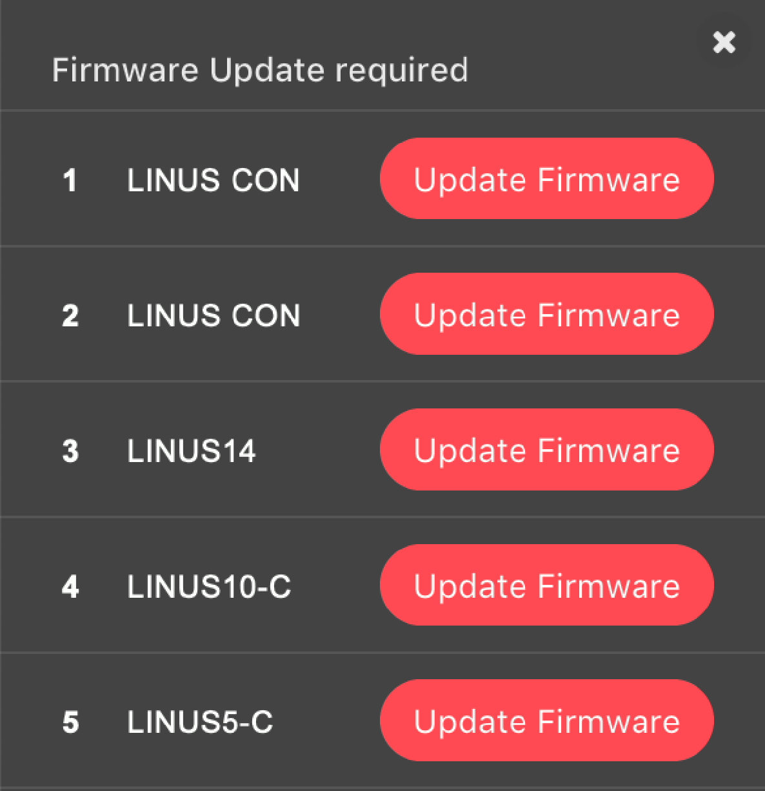
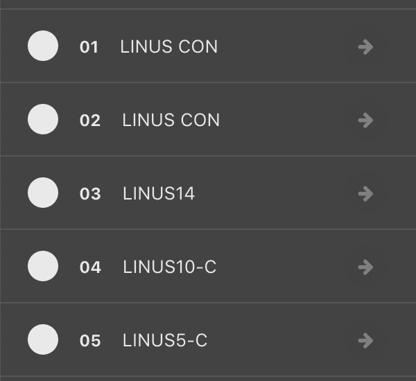
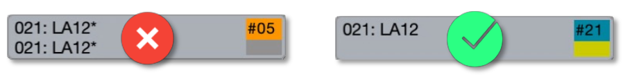
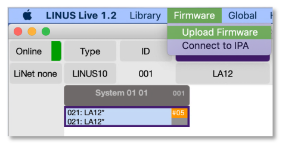
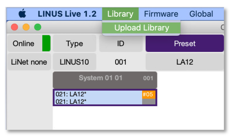
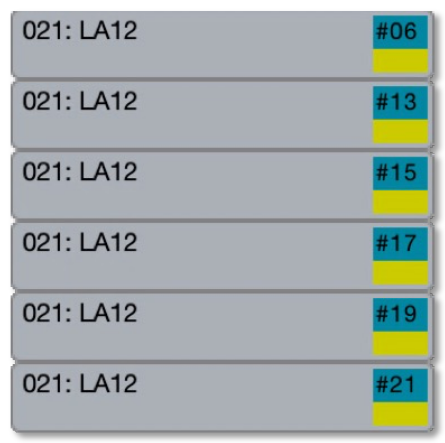
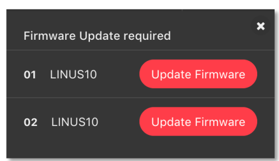
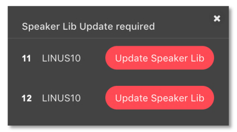

Update Procedure
================

Upgrading from LINUS Control v2.x to LINUS Control v2.4
--------------------------------------------------------

• Set your wired ethernet interface to 192.168.1.250 / 255.255.0.0
• Disable all other network interfaces, including Wi-Fi.
• Check your interface IP, Subnet Mask, and check you have disabled all other network interfaces, **including Wi-Fi**.
• Close any existing instance of LINUS Control.
• Launch LINUS Control v2.4.
• Click the Online button in the top right of the window.
• Network scanning will now start. In the bottom taskbar, an icon will be presented, showing how many amplifiers have been detected on the network. Click this button:

|

• You will now be presented with a view on the left of the workspace, showing you which units have been found on the network.  The units are shown with a Red ‘Update Firmware’ button beside them. Click all of these.

|

.. note::
    If after pressing the ‘Update Firmware’ button, it reappears again after a short period of time, power cycle the amplifier.  Once the ‘Update Firmware’ button is pressed, the amplifiers will disappear out of the discovery list.  Please wait at least 30 seconds for the amplifiers to show up again in the discovery list.

• The Front Panel LCD may present an error code, stating that the amplifier cannot find the Speaker Library. The error should be ignored.

    
|

.. note::
    LINUS10-C’s and LINUS5-C’S will require a power-cycle at this point. 
    
    Unplug the AC Power, wait 5 seconds, and re-insert AC Power when prompted.

• When the firmware has been updated on these devices, they will return to the discovery list, but they will not contain the speaker library. Please proceed to click the red ‘Update Speaker Lib’ button to continue:

.. image:: assets/images/update_procedure/firmwayupdaterequired2.png
    :align: center
    :width: 300

|

• When the speaker library has been pushed to all the devices, they will appear in the discovery list, as shown below:

|

• Press the ‘Add all to workspace’ button to finish the process. 

|

• The units are now ready to be deployed in an active system.

LINUS Amplifier Firmware Version
---------------------------------

The following firmware is included with LINUS Control v2.3:

+-----------------------+-------------------+
| Product               | Firmware Version  |
+=======================+===================+
| LINUS CON             | V1.70             |
+-----------------------+-------------------+
| LINUS 14 / LINUS14-D  | V3.70             |
+-----------------------+-------------------+
| LINUS10               | V2.70             |
+-----------------------+-------------------+
| LINUS12C              | V3.70             |
+-----------------------+-------------------+
| LINUS10-C             | V5.70             |
+-----------------------+-------------------+
| LINUS5-C              | V5.70             |
+-----------------------+-------------------+

LINUS10 – Upgrading
--------------------

First it is necessary to establish a fully functional network with the amplifiers on the LINUS Live v1.2.5 software. This ensures there are no connectivity issues that could cause issues during the Firmware update procedure.

• Establish a fully functional LINUS10 network with LINUS Live v1.2.5
• Ensure LINUS Live v1.2.5 is in sync with the amplifiers (no orange flags):

    
|

• Close LINUS Live v1.2.5
• Run LINUS Live v1.2.7 – the Firmware Migration Tool.
• Go Online. The units will be shown with a Red and Grey square, stating “Update FW”:

    
|

• Press the ‘Add Modules’ button:

    
|

• Select **up to** 6 Modules (12x LINUS10 Amplifiers).

.. note::
    If you select over 6 Modules, which is 12x LINUS10 Amplifiers, the Firmware update process will fail, and you will have to update the devices one at a time, using the Hardware Update Mode.

• Click Firmware, then Upload Firmware, then accept the pop-up dialog.

    
|

• LINUS Live v1.2.7 will close upon completion.
• Restart LINUS Live v1.2.7 and repeat, until all amplifiers have had their firmware updated.
• Restart LINUS Live v1.2.7
• Go Online. The units will be shown with a Red and Grey square, stating “Update Lib”:

    
|

• Press the ‘Add Modules’ button:

    
|

• Select **up to** 6 Modules (12x LINUS10 Amplifiers).
• Click Library, then Upload Library, then accept the pop-up dialog:

    
|

• LINUS Firmware Migrate will close upon completion.
• Restart LINUS Firmware Migrate v1.2.7 and repeat until all amplifiers have had their libraries updated.
• Restart LINUS Live v1.2.7
• Go Online. The units will be shown with a Green and Grey square:

    
|

• Press the ‘Add Modules’ button:

    
|

• They will now all have blue ‘in-sync’ flags:

    
|

• Close LINUS Live v1.2.7.

We will now configure the LINUS10’s so that they can be seen by LINUS Control v2.0.x, and the firmware can be updated to the latest stream.

.. note::
    From this moment onwards during the firmware upgrade procedure, limit the amount of LINUS10’s on the network to 24x at a time, using front panel ID Numbers #1 through #12. 
    
    After the update process is complete, there will be no limitation on simultaneous upgrades within the LINUS Control v2.0.x software / firmware streams.

.. warning::
    • Set all LINUS10’s to MASTER on the Front Panel LCD.
    • **Do NOT adjust the Front Panel ID number.**

• Launch LINUS Control v2.0.x
• Click the Online button in the top right of the window:

    
|

• Network scanning will now start. In the bottom taskbar, an icon will be presented, detailing how many amplifiers have been detected on the network. Click this button:

    
|

• On the left of the workspace, the amplifiers that have been detected on the network will be displayed. The LINUS10’s are shown with the Red ‘Update Firmware’ button. Click all of these.

    
|

.. note::
    If after pressing the ‘Update Firmware’ button, it reappears after a short period of time, power cycle the amplifier. Once the ‘Update Firmware’ button is pressed, the amplifiers will disappear out of the discovery list. Please wait at least 30 seconds for the amplifiers to show up in the discovery list.

• The Front Panel LCD may now present an error code:
This is stating that the amplifier cannot find the Speaker Library.
The message can be ignored or cleared with the Amplifier Front Panel ‘ESC’ key.

    
|

• When the firmware has been updated on these devices, they will return to the discoverylist. The speaker library now needs to be updated.
Click the red ‘Update Speaker Lib’ button to continue:

    
|

.. note::
    If the amplifier that was the ‘Slave’ does now show up now in the discovery list with the “Update Speaker Lib” button, you forgot to perform the step marked ‘Important’ above; whereby you should set all devices to Master & not adjust the ID. To recover the amplifiers, it is now necessary to place the master and slave in Hardware Update mode, then push the firmware to both of the amplifiers one at a time, prior to restarting this above procedure.

• When the speaker library has been pushed to all the devices, they will now show in the discovery list, as shown below:

    
|

• Press the ‘Add all to workspace’ button to finish the process.

    
|

• The LINUS10’s are now ready to be deployed in an active system.